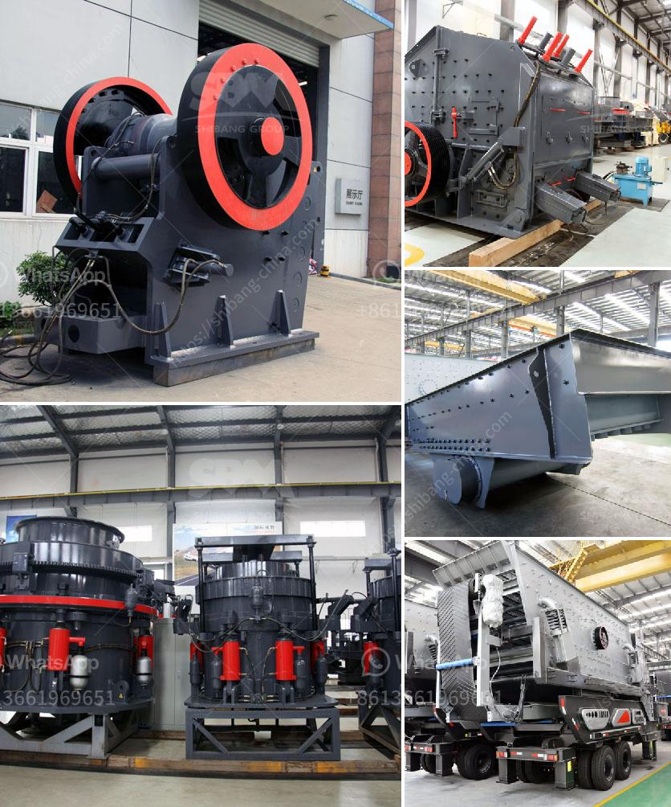

<h3>How is a jaw crusher feed, and why?</h3>
A jaw crusher is a type of primary crusher used in mines and ore processing plants. Jaw crushers are designed to crush the toughest materials through the use of compressive force (pressure). The jaw crusher design includes a set of two vertical jaws—a fixed (stationary) jaw and a swing (reciprocating) jaw. The swing jaw moves back and forth by a cam or pitman mechanism, acting as a connecting rod.

To feed the jaw crusher, small and medium-sized materials (up to 600mm) need to be initially crushed by jaw crushers. After the materials are finely crushed, the next step is discharge—moving the crushed materials out of the machine as soon as possible to prevent secondary damage to the jaw crusher. In general, the feed size distribution of jaw crushers cannot exceed 10 times the distance from the stationary jaw plate to the swing jaw plate.

When feed to jaw crushers, materials from the top of the entrance into the broken cavity, consisting of fixed jaw plate, movable jaw plate, and liner plate. The two jaw plates are lined with manganese steel to protect the machine from excessive wear and tear caused by the crushing process. The crushed materials are then discharged through the bottom opening.

The feeding mode of the jaw crusher is explained as follows: the materials to be crushed are evenly and continuously fed into the jaw crusher through the vibrating feeder, which is designed for steady feeding. The size of the materials should ideally be less than 80 to 85% of the gap between the two jaw plates, known as the closed side setting (CSS). This ensures a uniform feed distribution and avoids overloading the crusher.

An even and continuous feed is crucial for achieving optimal efficiency and preventing damage to the jaw crusher. Properly feeding materials not only increases production capacity but also extends the service life of the machine. If the feed is too large or contains large rocks, it can cause blockages and damage the equipment. On the other hand, if the feed is too small or unevenly distributed, it can lead to excessive wear on the jaw plates.

To ensure a consistent and reliable feed, it is important to select the appropriate vibrating feeder and adjust its settings accordingly. The feeder should be properly designed to handle the required capacity and material characteristics. Regular maintenance and inspections of the feeder are also necessary to identify and address any issues that may affect the feeding process.

In conclusion, the feeding of a jaw crusher is a critical process that directly affects its performance and efficiency. A proper and consistent feed size distribution can greatly enhance the productivity and lifespan of the machine. Therefore, it is important to carefully consider the characteristics of the materials being fed and ensure a well-designed feeding system to maximize the jaw crusher's capabilities.
<h3>Contact us</h3><ul><li><strong>Whatsapp:&nbsp;<a href="https://wa.me/8613661969651">+8613661969651</a></strong></li><li><a href="https://swt.shibang-china.com/?git&amp;zhl&amp;How is a jaw crusher feed and why"><strong>Online Service(chat now)</strong></a></li></ul><h3>Related</h3><ul><li><a href='Why did iron ore beneficiation use the reverse flotation cell.md'>Why did iron ore beneficiation use the reverse flotation cell?</a></li><li><a href='Why does the hopper need to be cleaned in the crusher plant.md'>Why does the hopper need to be cleaned in the crusher plant?</a></li><li><a href='Why is track mounted crushing plant at the pit rather than fixed plant.md'>Why is track mounted crushing plant at the pit rather than fixed plant?</a></li><li><a href='Why is there screening after crushing.md'>Why is there screening after crushing?</a></li><li><a href='Why is there a need to crush iron ore bearing rock.md'>Why is there a need to crush iron ore bearing rock?</a></li></ul>