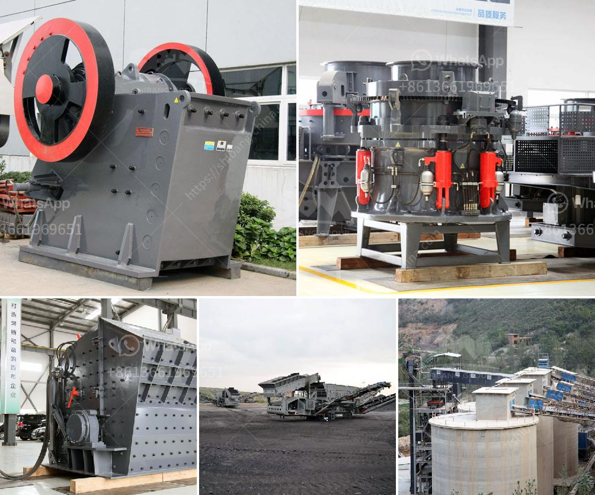

<h3>Why are carbon-forged balls used in ball mills?</h3>
Ball mills are a key tool used in the grinding and milling processes of many mineral processing industries. These mills rely on the grinding media to effectively reduce the size of the mineral particles and ensure a consistent and fine grind. Among various types of grinding media, carbon-forged balls have become increasingly popular due to their superior performance and numerous advantages.

Carbon-forged balls are made from a carefully selected combination of steel and carbon materials, which are then forged and heat-treated to achieve optimal hardness and wear resistance. This manufacturing process provides several benefits that make them highly suitable for use in ball mills.

One primary advantage of carbon-forged balls is their exceptional durability. The forged steel construction ensures high strength and resistance to impact and abrasion, allowing them to withstand the rigorous grinding conditions within the ball mill. This durability ensures a longer lifespan for the grinding media, reducing the frequency of replacements and downtime, ultimately leading to cost savings for the mining or mineral processing operation.

In addition to their durability, carbon-forged balls also exhibit excellent wear resistance. The carbon content, combined with the heat treatment process, helps create a hardened surface layer that minimizes wear and deformation, thereby maximizing the grinding efficiency. The reduced wear rate of carbon-forged balls means less consumption of grinding media, resulting in lower overall operational costs.

Furthermore, carbon-forged balls offer superior performance in terms of grinding efficiency. The hardness and optimized microstructure of the balls enable them to effectively grind and reduce the size of the mineral particles. The smooth and consistent surface of the balls also promotes efficient grinding, ensuring a more uniform and fine product. This finer grind is critical in many mineral processing applications, as it enhances mineral liberation and maximizes recovery rates.

The use of carbon-forged balls in ball mills also contributes to environmental sustainability. The longer lifespan and reduced wear rate translate into fewer discarded balls and less waste generated. This not only reduces the environmental impact but also minimizes the costs associated with waste disposal and replacement. Additionally, the energy efficiency of ball mills is improved when using high-quality grinding media, further contributing to sustainable practices.

In conclusion, carbon-forged balls are preferred grinding media for ball mills due to their exceptional durability, wear resistance, and grinding efficiency. The combination of steel and carbon, along with the forging and heat treatment processes, ensures superior performance and extended lifespan. These benefits result in cost savings, improved grinding efficiency, reduced environmental impact, and increased sustainability. When selecting grinding media for ball mills, considering carbon-forged balls is a wise choice for enhancing overall operational performance.
<h3>Contact us</h3><ul><li><strong>Whatsapp:&nbsp;<a href="https://wa.me/8613661969651">+8613661969651</a></strong></li><li><a href="https://swt.shibang-china.com/?git&amp;zhl&amp;Why are carbonforged balls used in ball mills"><strong>Online Service(chat now)</strong></a></li></ul><h3>Related</h3><ul><li><a href='Why are carbonforged balls used in ball mills.md'>Why are carbon-forged balls used in ball mills?</a></li><li><a href='Why are there advantages to crushing ore in the mining process.md'>Why are there advantages to crushing ore in the mining process?</a></li><li><a href='Why is a ball mill used for grinding silica sand.md'>Why is a ball mill used for grinding silica sand?</a></li><li><a href='Why is the cone crusher known as a gyratory crusher.md'>Why is the cone crusher known as a gyratory crusher?</a></li><li><a href='Why does a belt conveyor vibrate.md'>Why does a belt conveyor vibrate?</a></li></ul>