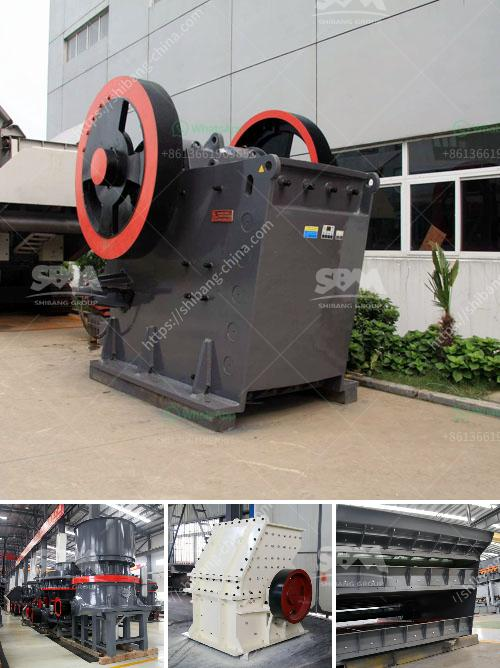

<h3>Why are classifiers used in ball mills?</h3>
Ball mills are a fundamental part of the manufacturing industry in the USA as well as around the world. Ball mills crush material into various sizes and extract valuable minerals from the ore, contributing to the overall economic value of the mining process. However, achieving an optimal particle size and classification is crucial for efficient operation and maximizing the output of the ball mill. This is where classifiers come into play.

Classifiers are mechanical devices that separate particles according to their size, shape, and density. In the case of ball mills, classifiers are used to filter out fine particles from the oversize material, allowing only the desired size particles to pass through for further processing. Here are some key reasons why classifiers are used in ball mills:

1. Improved Grinding Efficiency: Classifiers help to achieve the desired particle size by removing oversized material. When large particles are present in the mill, they can hinder the grinding process, reducing overall efficiency and increasing energy consumption. By utilizing classifiers, the grinding process becomes more efficient, enhancing the milling operation's productivity and saving costs.

2. Consistent Product Quality: Achieving a uniform particle size distribution is critical in many industries, especially in the production of cement and minerals. Classifiers ensure that the final product meets the desired specifications and quality standards. By removing oversize particles, classifiers contribute to the production of a more consistent and homogeneous product.

3. Controlling the Milling Circuit: The presence of classifiers enables mill operators to control and fine-tune the milling circuit. By adjusting the classifier settings, operators can influence the particle size distribution and optimize the mill's performance. This control allows for better management of the overall process and improved process stability.

4. Preventing Wear and Tear: Oversize particles can cause excessive wear and tear on the mill components, including liners and grinding media. By removing these particles, classifiers help to prolong the lifespan of the mill and reduce maintenance costs. This becomes particularly crucial when dealing with abrasive materials that can cause significant damage to the mill internals.

5. Tailoring Operations to Specific Needs: Different industries and applications require specific particle size distributions. Classifiers allow for tailoring the milling process to suit the specific requirements of each application. From pharmaceuticals to minerals and everything in between, the ability to control particle size distribution is essential for optimizing the outcome of the process.

In conclusion, classifiers are integral to the ball milling process due to their ability to control particle size distribution, improve grinding efficiency, and ensure consistent product quality. By removing oversize particles, classifiers contribute to the overall success of the milling operation, reducing energy consumption, and enhancing productivity. With their versatility and ability to be tailored to specific needs, classifiers play a vital role in numerous industries and applications, making them an indispensable tool in the ball mill circuit.
<h3>Contact us</h3><ul><li><strong>Whatsapp:&nbsp;<a href="https://wa.me/8613661969651">+8613661969651</a></strong></li><li><a href="https://swt.shibang-china.com/?git&amp;zhl&amp;Why are classifiers used in ball mills"><strong>Online Service(chat now)</strong></a></li></ul><h3>Related</h3><ul><li><a href='Why use a doubledrive in a ball mill.md'>Why use a double-drive in a ball mill?</a></li><li><a href='Why is basalt used as an aggregate for road construction.md'>Why is basalt used as an aggregate for road construction?</a></li><li><a href='Why does a belt conveyor vibrate.md'>Why does a belt conveyor vibrate?</a></li><li><a href='Why is track mounted crushing plant at the pit rather than fixed plant.md'>Why is track mounted crushing plant at the pit rather than fixed plant?</a></li><li><a href='Why is manganese jaw used in a crusher.md'>Why is manganese jaw used in a crusher?</a></li></ul>