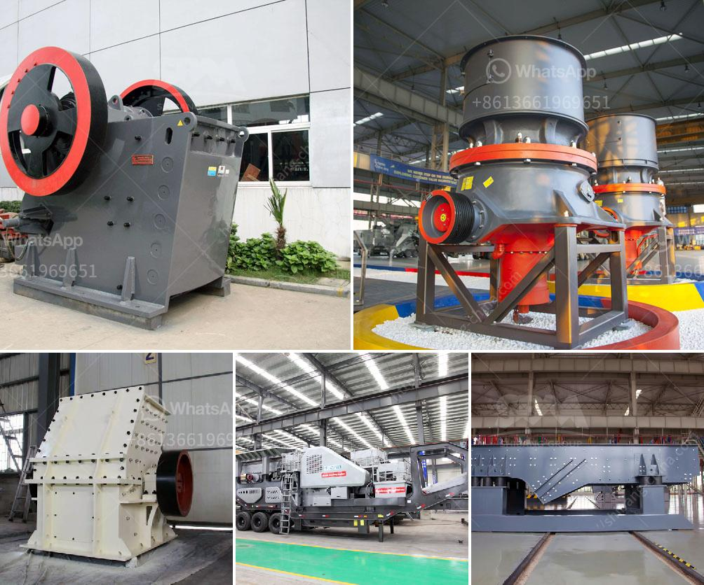

<h3>Why does the hopper need to be cleaned in the crusher plant?</h3>
The hopper is an important component in the crusher plant to keep the flow of materials smooth and steady. However, due to certain factors, the hopper may get clogged, leading to poor material flow. In such cases, the hopper needs to be cleaned to ensure efficient and uninterrupted operation of the crusher plant.

One of the primary reasons why the hopper needs cleaning is the accumulation of debris and materials that get stuck. As the crusher plant processes various materials, such as rocks, ores, and minerals, it is common for some of them to get lodged in the hopper. These materials can include oversized pieces, fine particles, or even pieces of machinery and equipment that may accidentally fall into the hopper during loading.

When debris and materials accumulate in the hopper, it can cause blockages in the feeder system, hindering the flow of materials into the crusher. This can result in reduced productivity, increased downtime, and ultimately affect the overall efficiency of the crusher plant. By regularly cleaning the hopper, these blockages can be prevented, ensuring smooth and uninterrupted material flow.

Another reason why the hopper needs cleaning is the buildup of dust and fines. Crushing and screening processes generate a significant amount of dust, which can settle in the hopper over time. Dust can be harmful to the working environment and, in large amounts, can even pose health risks to the workers operating the crusher plant.

Moreover, the accumulation of dust in the hopper can cause issues such as clogging of chutes, blockages in the spray nozzles used for dust suppression, and increased wear and tear of the equipment. By cleaning the hopper regularly and removing the dust and fines, these issues can be mitigated, ensuring a safe and efficient workplace and prolonging the lifespan of the equipment.

Furthermore, cleaning the hopper also helps in maintaining the quality of the processed materials. When materials (such as ores or aggregates) get stuck in the hopper for an extended period, they can become contaminated or even undergo chemical reactions due to exposure to moisture or other environmental factors. This can impact the quality and specifications of the final products produced by the crusher plant.

In conclusion, cleaning the hopper in the crusher plant is crucial for ensuring uninterrupted material flow, preventing blockages, maintaining a safe working environment, extending the lifespan of the equipment, and preserving the quality of the final products. By regularly cleaning the hopper and removing debris, materials, dust, and fines, operators can optimize the operation of the crusher plant and achieve maximum productivity. It is essential to incorporate hopper cleaning into the regular maintenance schedule to avoid any potential issues and to ensure the crusher plant operates at its best capacity.
<h3>Contact us</h3><ul><li><strong>Whatsapp:&nbsp;<a href="https://wa.me/8613661969651">+8613661969651</a></strong></li><li><a href="https://swt.shibang-china.com/?git&amp;zhl&amp;Why does the hopper need to be cleaned in the crusher plant"><strong>Online Service(chat now)</strong></a></li></ul><h3>Related</h3><ul><li><a href='How is a jaw crusher feed and why.md'>How is a jaw crusher feed, and why?</a></li><li><a href='Why are classifiers used in ball mills.md'>Why are classifiers used in ball mills?</a></li><li><a href='Why does the hopper need to be cleaned in the crusher plant.md'>Why does the hopper need to be cleaned in the crusher plant?</a></li><li><a href='Why is there less dust in a vertical roller mill.md'>Why is there less dust in a vertical roller mill?</a></li><li><a href='Why is a vibrating screen used to send ore to a rock crusher.md'>Why is a vibrating screen used to send ore to a rock crusher?</a></li></ul>