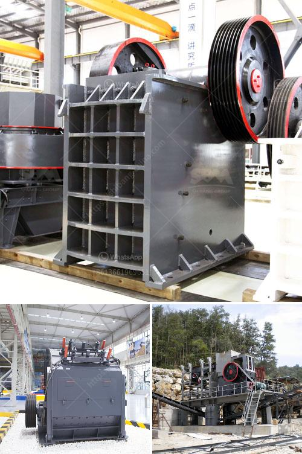

<h3>Why is a cyclone required in a cement ball mill?</h3>
A cyclone is required in a cement ball mill because it separates the fine material from the coarse material. This allows the fine particles to be sent to the cement silo, while the coarse particles are returned to the mill for further grinding.

Cement is a hydraulic binder, meaning it sets and hardens when water is added. It is commonly used in construction projects as a binding agent for concrete. The manufacturing of cement involves a series of processes, including crushing, grinding, mixing, and burning.

In the grinding process, limestone and other raw materials are crushed into a fine powder. This powder is then mixed with gypsum to control the setting properties of the cement. The mixture is further ground in a cement mill, which is a horizontal steel cylinder filled with steel balls.

As the cement mill rotates, the steel balls tumble and crush the clinker into a fine powder. This powder is then sent to a cement silo via a bucket elevator. However, during the grinding process, some fine particles may escape the mill with the air currents.

Here's where the cyclone comes into play. A cyclone is a device that utilizes centrifugal force to separate particles based on their size and density. In a cement mill, the cyclone is used to separate the fine particles from the coarse particles.

The fine particles, which are the desired product, are collected in the cyclone and then sent to the cement silo for storage. On the other hand, the coarse particles, which are not yet adequately ground, are returned to the mill for further grinding. This ensures that the desired fineness is achieved.

Without a cyclone, the fine particles would escape with the air currents and result in the loss of product. Additionally, the presence of these fine particles in the finished cement could negatively impact its quality and performance.

Moreover, the use of a cyclone in a cement ball mill improves the efficiency of the grinding process. By separating the fine particles, the mill can achieve a higher grinding capacity without overloading the motor. This leads to a more productive and stable operation.

Furthermore, the cyclone also helps to reduce wear and tear on the mill's internal components. As the coarse particles are returned to the mill for further grinding, they act as a protective layer, preventing direct contact between the steel balls and the mill lining. This minimizes the chances of abrasion and prolongs the lifespan of the equipment.

In conclusion, a cyclone is required in a cement ball mill to separate the fine particles from the coarse particles. This ensures that the desired product is collected in the cement silo, while the particles that need further grinding are returned to the mill. The use of a cyclone improves the efficiency of the grinding process, reduces wear and tear, and enhances the overall performance of the mill.
<h3>Contact us</h3><ul><li><strong>Whatsapp:&nbsp;<a href="https://wa.me/8613661969651">+8613661969651</a></strong></li><li><a href="https://swt.shibang-china.com/?git&amp;zhl&amp;Why is a cyclone required in a cement ball mill"><strong>Online Service(chat now)</strong></a></li></ul><h3>Related</h3><ul><li><a href='Why does a ball mill start slowly.md'>Why does a ball mill start slowly?</a></li><li><a href='Why should we use aggregate washing systems.md'>Why should we use aggregate washing systems?</a></li><li><a href='Why use a doubledrive in a ball mill.md'>Why use a double-drive in a ball mill?</a></li><li><a href='Why use an impact crusher instead of other crushers.md'>Why use an impact crusher instead of other crushers?</a></li><li><a href='Why did iron ore beneficiation use the reverse flotation cell.md'>Why did iron ore beneficiation use the reverse flotation cell?</a></li></ul>