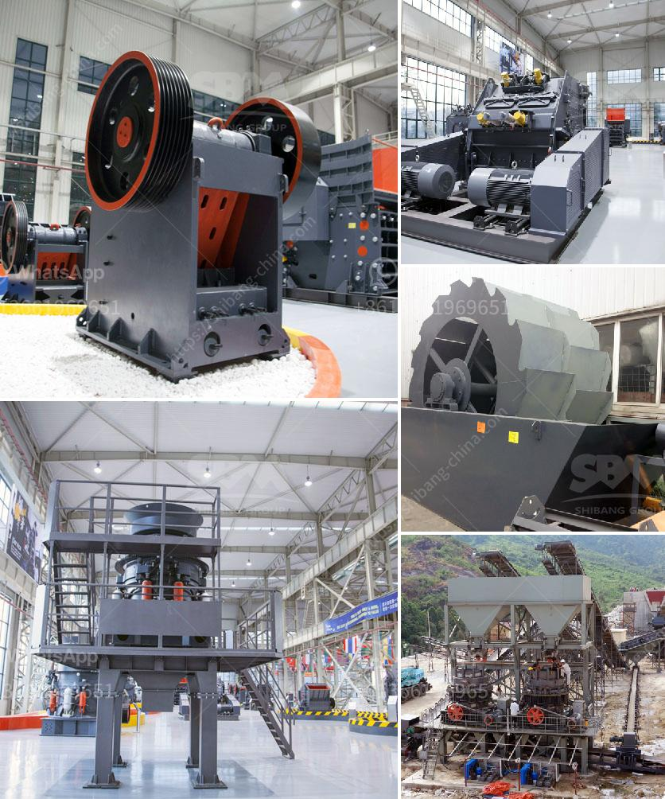

<h3>Why is a jaw crusher used to crush aluminum ore?</h3>
Aluminum may be the most abundant crustal metals, it has many widely used applications, but the primary reason for its extensive use is its strength and durability. Aluminum ore can be a key ore, and is also widely used in the aerospace industry, automotive industry, and supplies, construction, and the housing industry. The aluminum ore will be also used in cement, chemicals, and other industries. To make aluminum, it must be crushed and processed accordingly. In this case, a jaw crusher is used for the initial crushing of aluminum ore, and then aluminum ore is crushed into finer particles by secondary crushers.

The choice of a jaw crusher is actually not difficult. It is necessary to understand what kind of material the crusher will deal with, what kind of processing capacity the crusher requires, and what kind of crushing requirements the ore crusher adopts. In terms of dealing with hard rock, the ore should be crushed by jaw crusher firstly, and then crushed by cone crusher and then finally crushed by sand making machine. Next, the crushed ore is screened by vibrating screen and it is suitable for various screens.

Ore containing aluminum, bauxite, and alumina can be considered high quality aluminum ore. After crushing and grinding, 1-2% of the aluminum content is recovered, and the cast aluminum impurities rich bauxite ore is melted in an electric arc furnace to obtain a pure aluminum material. The process is essentially the same as the aluminum manufacturing process originally used in the Hall-Heroult process. Aluminum ore crusher, jaw crusher is mainly used for crushing various ores and large materials with compression strength not more than 320Mpa into medium-sized grains. The crushing chamber of the jaw crusher is composed of a movable jaw and a fixed jaw. The jaw crusher is the most widely used ore crusher in stone production line.

The main types of jaw crusher are PE250×400, PE400×600, PE600×900, PE750×1060, PE900×1200, PE1200×1500 and PE250×400. Jaw crusher is widely used in mining, smelting, building materials, roads, railways, water conservancy and chemical industry and many other departments. In China, the most commonly used jaw crusher is the PE series jaw crusher, PE-250×400.

The old-type jaw crusher adopts a large crank rocker mechanism to drive the movable jaw. When the eccentric shaft is rotated, the connecting rod reciprocates up and down, and the two thrust plates are reciprocally curved to push the movable jaw. The plate is crushed or split by the weight of the material. After crushing, the crushed material is discharged from the lower side of the machine and becomes the final product. The crushed material of the old-type jaw crusher is generally shaped, and the crushed material is mostly cubes or similar shapes. The discharge port is underneath.

In conclusion, the jaw crusher is essential for crushing aluminum ore because the crushing process enables the release of unique physical properties that are essential for various applications. The jaw crusher is designed to reduce the size of the large rocks into smaller aggregate such as gravel and sand, making them suitable for applications in concrete production and road construction.
<h3>Contact us</h3><ul><li><strong>Whatsapp:&nbsp;<a href="https://wa.me/8613661969651">+8613661969651</a></strong></li><li><a href="https://swt.shibang-china.com/?git&amp;zhl&amp;Why is a jaw crusher used to crush aluminum ore"><strong>Online Service(chat now)</strong></a></li></ul><h3>Related</h3><ul><li><a href='Why is vertical roller millbased dry grinding not used in iron ore processing.md'>Why is vertical roller mill-based dry grinding not used in iron ore processing?</a></li><li><a href='Why are carbonforged balls used in ball mills.md'>Why are carbon-forged balls used in ball mills?</a></li><li><a href='Why does the lubricating oil pressure increase in a cone crusher.md'>Why does the lubricating oil pressure increase in a cone crusher?</a></li><li><a href='Why is a jaw crusher used to crush aluminum ore.md'>Why is a jaw crusher used to crush aluminum ore?</a></li><li><a href='Why should we use aggregate washing systems.md'>Why should we use aggregate washing systems?</a></li></ul>