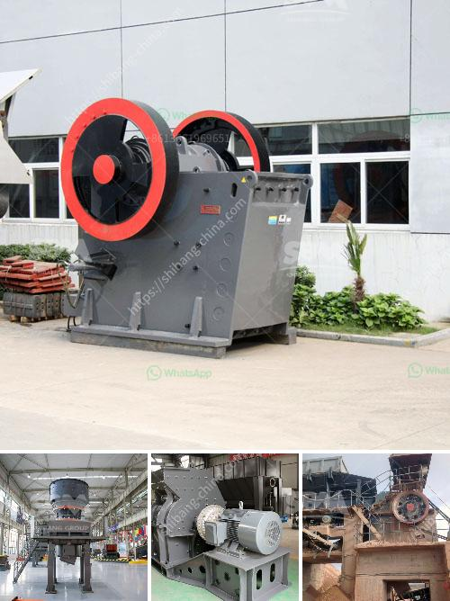

<h3>Why is a vibrating screen used to send ore to a rock crusher?</h3>
In the world of mining and quarrying, a crucial element is the extraction of valuable minerals or other geological materials from the Earth. These valuable materials need to be processed further to obtain the desired product. However, before any processing can take place, the raw materials need to be separated and prepared for the next stage of the operation. This is where vibrating screens come into play.

A vibrating screen is a machine used to separate materials into various sizes for further processing. It is a vital part of the crushing and screening process, helping to ensure that the final product is of consistent, high quality.

One of the primary reasons why a vibrating screen is used in this process is to sort the ore by size. By doing this, the smaller particles can be sent directly to the crusher, while the larger ones are transferred to a secondary crusher for further processing. This ensures that the rock crusher only processes the materials that are suitable for crushing, resulting in a more efficient and productive operation.

Another key reason for using a vibrating screen in this process is to remove any impurities or contaminants. The screens are designed to separate the ore from any unwanted materials, such as rocks, dirt, or debris. This is crucial because impurities can have a negative impact on the quality of the final product, affecting its value and marketability. By removing these impurities, the vibrating screen helps to ensure a cleaner and purer end product.

The vibrating screen also plays a crucial role in the recycling of materials. Many mining and quarrying operations produce a significant amount of waste material, which can often be recycled and used again. The vibrating screen helps to separate the reusable materials from the waste, allowing them to be processed and reused in the production process. This not only reduces waste and saves valuable resources but also contributes to a more sustainable and environmentally friendly operation.

Moreover, a vibrating screen is highly efficient in its operation. It can handle large volumes of ore, screening them at a high speed, which helps to increase productivity and throughput. The design of the screen allows for different mesh sizes, enabling it to meet the specific requirements of the operation and ensure the desired quality and size of the final product.

In conclusion, a vibrating screen is a vital component in the mining and quarrying industry, allowing for the separation and preparation of valuable materials for further processing. By sorting and removing impurities, it helps to achieve a consistent and high-quality final product. Furthermore, it enables the recycling of waste materials and contributes to a more sustainable operation. With its efficiency and versatility, it is clear why a vibrating screen is used to send ore to a rock crusher, providing an essential step in the extraction process and ensuring optimum productivity and profitability.
<h3>Contact us</h3><ul><li><strong>Whatsapp:&nbsp;<a href="https://wa.me/8613661969651">+8613661969651</a></strong></li><li><a href="https://swt.shibang-china.com/?git&amp;zhl&amp;Why is a vibrating screen used to send ore to a rock crusher"><strong>Online Service(chat now)</strong></a></li></ul><h3>Related</h3><ul><li><a href='Why is coal crushed in power plants.md'>Why is coal crushed in power plants?</a></li><li><a href='Why is a crusher section used in the cement industry.md'>Why is a crusher section used in the cement industry?</a></li><li><a href='Why is manganese jaw used in a crusher.md'>Why is manganese jaw used in a crusher?</a></li><li><a href='Why is it difficult to start a ball mill.md'>Why is it difficult to start a ball mill?</a></li><li><a href='Why does a steel plant need a slag processing plant.md'>Why does a steel plant need a slag processing plant?</a></li></ul>