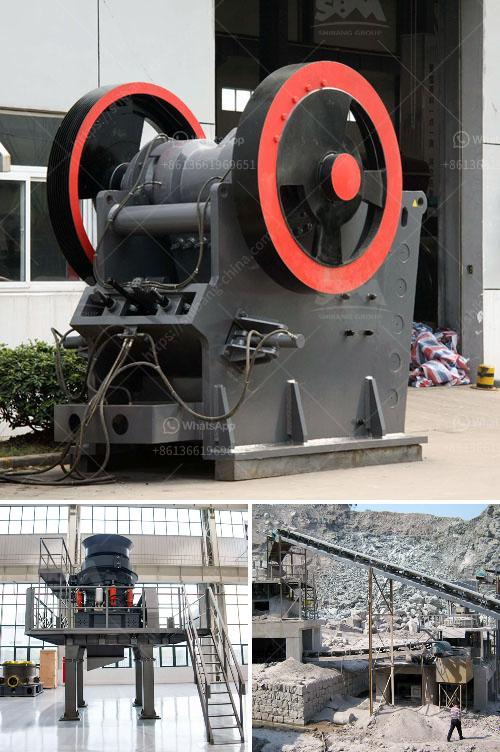

<h3>Why is ash removed in a coal preparation plant?</h3>
Coal continues to be one of the world's primary sources of energy, particularly for electricity generation. However, before it can be used for this purpose, it must undergo a rigorous cleaning process at coal preparation plants (CPPs). The main objective of a CPP is to remove impurities from coal, such as ash, rock, and other non-combustible materials. In this article, we will explore in detail why ash is removed in a coal preparation plant.

Ash is the residue left after the combustion of coal. It consists of inorganic minerals and unburnt carbon, which can make up a significant portion of the overall weight of coal. The presence of ash reduces the heating value of coal, thereby decreasing its energy content. High ash content in coal not only reduces its quality but also poses various challenges during the combustion process.

One of the primary reasons ash is removed in a CPP is to improve the efficiency of the combustion process. High ash content causes the formation of clinker ash, which can damage the boilers and decrease the overall efficiency of coal-fired power plants. Removing ash at the CPP ensures that the coal supplied to power plants has a lower ash content, resulting in improved combustion efficiency and reduced maintenance costs.

Furthermore, ash also contributes to environmental pollution when released into the atmosphere. During combustion, ash particles can become aerosolized and released with the flue gases. These particles can contain heavy metals and other harmful substances, posing a risk to human health and the environment. By removing ash at the CPP, power plants can significantly reduce the release of these pollutants, helping to mitigate the environmental impact of coal usage.

Another crucial aspect of ash removal is the recovery of valuable resources that can be found within it. Ash can contain trace amounts of valuable elements like aluminum, iron, and silica. By separating and collecting these components, they can be further processed and reused in various industries, reducing the need for extracting these resources from other sources. Ash recycling not only contributes to a more sustainable approach but can also generate additional revenue for the coal preparation plant.

Efficient ash removal is achieved through a variety of techniques employed at a CPP. These techniques include gravity separation, froth flotation, magnetic separation, and centrifugal separation. Depending on the characteristics of the coal and the specific requirements of the client, different methods are utilized to achieve the desired ash content in the final product.

In conclusion, ash is removed in a coal preparation plant for several reasons. It improves the efficiency of the combustion process, reduces environmental pollution, and allows for the recovery of valuable resources. By removing ash, the quality of coal is enhanced, leading to increased energy production and reduced environmental impact. Coal preparation plants play a critical role in ensuring that coal is cleaned and ready for efficient use in power generation, helping to meet the world's energy demands in a sustainable and responsible manner.
<h3>Contact us</h3><ul><li><strong>Whatsapp:&nbsp;<a href="https://wa.me/8613661969651">+8613661969651</a></strong></li><li><a href="https://swt.shibang-china.com/?git&amp;zhl&amp;Why is ash removed in a coal preparation plant"><strong>Online Service(chat now)</strong></a></li></ul><h3>Related</h3><ul><li><a href='Why does the hopper need to be cleaned in the crusher plant.md'>Why does the hopper need to be cleaned in the crusher plant?</a></li><li><a href='Why use a doubledrive in a ball mill.md'>Why use a double-drive in a ball mill?</a></li><li><a href='Why is a cyclone required in a cement ball mill.md'>Why is a cyclone required in a cement ball mill?</a></li><li><a href='Why is artificial sand used.md'>Why is artificial sand used?</a></li><li><a href='Why is manganese ore crushed.md'>Why is manganese ore crushed?</a></li></ul>