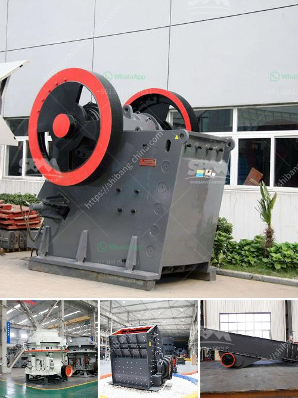

<h3>Why is basalt used as an aggregate for road construction?</h3>
When it comes to road construction, choosing the right materials is crucial for ensuring durability, stability, and longevity. One such material that has gained popularity in recent years is basalt. Basalt is a common igneous rock formed from the rapid cooling of lava, making it an ideal material for various construction applications, including road construction. There are several reasons why basalt is preferred as an aggregate for road construction.

First and foremost, basalt is incredibly strong and durable. Its high compressive strength allows it to withstand heavy traffic loads and resist deformation, which is essential for road surfaces that often experience high volumes of vehicles. Unlike other materials, such as limestone or granite, basalt has excellent weathering resistance, meaning it can withstand the impacts of weathering processes without deteriorating quickly. This durability ensures a longer lifespan for the road, reducing maintenance costs in the long run.

Another significant advantage of using basalt as an aggregate for road construction is its exceptional skid resistance. Skid resistance is a crucial characteristic, especially in wet or icy conditions, as it affects the overall safety of the road. The rough texture of basalt helps prevent vehicles from skidding or slipping during braking or accelerating, reducing the risk of accidents. This makes basalt an excellent choice for roads that experience heavy rainfall or freezing temperatures.

Basalt is also known for its excellent load-bearing capabilities. As a dense and compact rock, it can withstand heavy loads without significant deformation or settlement. This characteristic is particularly important for road construction projects in areas with challenging terrain, where the road must support the weight of vehicles and withstand the forces generated by mountains or hills.

Furthermore, basalt has excellent resistance to chemical erosion, making it suitable for roads that may be exposed to chemicals, such as de-icing agents. Many regions use chemical compounds to melt snow and ice on the roads during winter. The corrosive nature of these chemicals can deteriorate the road's surface if not resistant materials are used. Basalt's resistance to chemical erosion ensures that the road will maintain its structural integrity even in the presence of these agents.

Lastly, basalt's abundance in many regions makes it a cost-effective choice for road construction. Compared to other alternatives like limestone or granite, basalt is readily available in many areas, reducing transportation costs. This accessibility makes basalt a sustainable option, as it decreases the environmental impact associated with long-distance transportation of construction materials.

In conclusion, the use of basalt as an aggregate for road construction offers numerous advantages. Its exceptional strength, durability, skid resistance, load-bearing capabilities, resistance to chemical erosion, and cost-effectiveness make it an ideal choice for road projects. As we continue to improve road infrastructure globally, considering sustainable and long-lasting materials like basalt will play a significant role in enhancing the safety and longevity of our road networks.
<h3>Contact us</h3><ul><li><strong>Whatsapp:&nbsp;<a href="https://wa.me/8613661969651">+8613661969651</a></strong></li><li><a href="https://swt.shibang-china.com/?git&amp;zhl&amp;Why is basalt used as an aggregate for road construction"><strong>Online Service(chat now)</strong></a></li></ul><h3>Related</h3><ul><li><a href='Why is manganese jaw used in a crusher.md'>Why is manganese jaw used in a crusher?</a></li><li><a href='Why is a jaw crusher used to crush aluminum ore.md'>Why is a jaw crusher used to crush aluminum ore?</a></li><li><a href='Why are there advantages to crushing ore in the mining process.md'>Why are there advantages to crushing ore in the mining process?</a></li><li><a href='Why does the temperature of the mill grinding roller become high.md'>Why does the temperature of the mill grinding roller become high?</a></li><li><a href='Why is there screening after crushing.md'>Why is there screening after crushing?</a></li></ul>