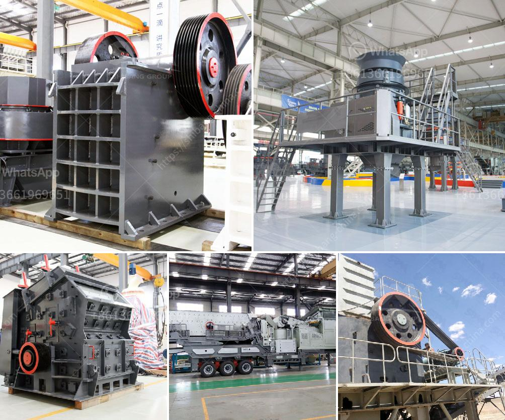

<h3>Why is coal crushed in power plants?</h3>
Coal is a fossil fuel that has been used as a source of energy for centuries. It is considered a reliable and cost-effective fuel for generating electricity in power plants. However, before it can be used efficiently in power plants, it needs to be crushed into different sizes or grades to meet the specific requirements of combustion.

One of the primary reasons coal is crushed in power plants is to reduce the size of coal particles to increase its efficiency for combustion. The process of crushing coal to a more manageable size is an important step in the processing chain. Primary crushers reduce a wide range of large Run of Mine (RoM) coal to either a marketable product or a range that can be more easily handled by the preparation plant.

Once the coal is crushed, it is then mixed with water and transported to a coal slurry pipeline, where it is further broken down into smaller particles. The slurry is then sent to a coal washing plant and undergoes a series of processes, including flotation, dewatering, and centrifugation, to remove impurities and further enhance its quality.

Crushing coal to a specific size allows the efficient combustion of coal and reduces emissions during combustion. Although coal is a highly carbon-intensive fuel, advancements in technology have made it possible to reduce its environmental impact. Crushing coal helps in reducing not only the emissions but also the environmental pollution caused by coal dust and fly ash during the combustion process.

Another reason coal is crushed in power plants is to ensure uniformity in its size and consistency. Crushing coal to a uniform size ensures that each particle provides the optimal surface for combustion, allowing the coal to burn more efficiently and produce more heat. This consistency in coal size also helps facilitate the transport and storage of coal in power plants.

Crushing coal also has economic benefits. By reducing the size of coal particles, power plants can increase their productivity and generate more electricity. This, in turn, helps meet the growing energy demands of industries and households. Furthermore, crushing coal into smaller particles allows for its efficient utilization, minimizing waste and maximizing the overall energy output.

Moreover, crushed coal is easier to handle, store, and transport. The reduction in size ensures that coal can be easily transported using conveyor belts or trucks. It can also be stored in silos or stockpiles without the risk of segregation or separation of coal particles of different sizes. The ease of handling and storage contributes to the efficiency of power plant operations.

In conclusion, crushing coal in power plants is an essential process to improve the efficiency and environmental performance of combustion. By reducing coal to a uniform size, it ensures better combustion, decreases emissions, and enhances energy output. Additionally, crushing coal allows for easier handling, storage, and transportation, benefiting power plant operations on multiple fronts. As technology advances, the crushing processes are becoming more efficient, ensuring the continued use of coal as a reliable and cost-effective fuel for power generation.
<h3>Contact us</h3><ul><li><strong>Whatsapp:&nbsp;<a href="https://wa.me/8613661969651">+8613661969651</a></strong></li><li><a href="https://swt.shibang-china.com/?git&amp;zhl&amp;Why is coal crushed in power plants"><strong>Online Service(chat now)</strong></a></li></ul><h3>Related</h3><ul><li><a href='Why is the Quarry Act important.md'>Why is the Quarry Act important?</a></li><li><a href='Why is it difficult to start a ball mill.md'>Why is it difficult to start a ball mill?</a></li><li><a href='Why is there less dust in a vertical roller mill.md'>Why is there less dust in a vertical roller mill?</a></li><li><a href='Why did iron ore beneficiation use the reverse flotation cell.md'>Why did iron ore beneficiation use the reverse flotation cell?</a></li><li><a href='Why does the lubricating oil pressure increase in a cone crusher.md'>Why does the lubricating oil pressure increase in a cone crusher?</a></li></ul>