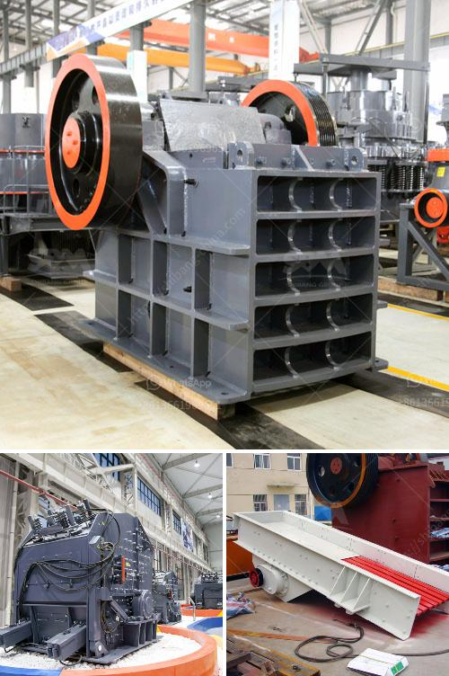

<h3>Why is it difficult to start a ball mill?</h3>
A ball mill is a type of grinder used to grind and blend materials for use in mineral dressing processes, paints, pyrotechnics, ceramics, and selective laser sintering. It works on the principle of impact and attrition: size reduction is done by impact as the balls drop from near the top of the shell. However, starting a ball mill requires a significant amount of time, skills, and resources, which often makes it a challenging task for many.

One of the primary reasons why it is difficult to start a ball mill is due to its extreme weight. A typical ball mill weighs more than a hundred tons, making it very cumbersome for many individuals or organizations to transport it to the desired location. This weight poses logistical challenges as specialized equipment and machinery may be required to lift and move the ball mill, increasing costs and delays in the process.

Another factor that contributes to the difficulty in starting a ball mill is its complex structure. Ball mills consist of a rotating hollow cylinder with compartments, which are filled with grinding media such as steel balls. The rotation of the cylinder causes the grinding media to cascade, creating a grinding and milling effect. This intricate design makes it challenging to assemble and disassemble the ball mill, as it requires a thorough understanding of the machine's components and how they interact with each other.

Additionally, the power requirements for starting a ball mill are quite high. Ball mills are typically powered by electrical motors, and the starting torque for these motors is often several times the full load torque, which can result in high electrical demand and potential power grid disruptions. Overcoming this high starting current is crucial to avoid damage to the motor and ensure a successful startup of the ball mill.

Moreover, ball mills require precise control systems to regulate the various parameters such as rotational speed, temperature, and grinding media density. These control systems are complex and often require skilled operators or advanced automation technology. Without proper control, the operation of the ball mill may be inefficient, leading to reduced grinding performance or even equipment damage.

In conclusion, starting a ball mill is a complex and challenging task, requiring careful planning, skilled labor, and specialized equipment. The extreme weight of the ball mill, its intricate structure, high power requirements, and the need for precise control systems all contribute to the difficulty of starting a ball mill. However, with proper preparation, expertise, and resources, these challenges can be overcome, allowing for a successful and efficient operation of this essential industrial tool.
<h3>Contact us</h3><ul><li><strong>Whatsapp:&nbsp;<a href="https://wa.me/8613661969651">+8613661969651</a></strong></li><li><a href="https://swt.shibang-china.com/?git&amp;zhl&amp;Why is it difficult to start a ball mill"><strong>Online Service(chat now)</strong></a></li></ul><h3>Related</h3><ul><li><a href='Why are classifiers used in ball mills.md'>Why are classifiers used in ball mills?</a></li><li><a href='Why does the lubricating oil pressure increase in a cone crusher.md'>Why does the lubricating oil pressure increase in a cone crusher?</a></li><li><a href='Why is manganese ore crushed.md'>Why is manganese ore crushed?</a></li><li><a href='Why does a ball mill start slowly.md'>Why does a ball mill start slowly?</a></li><li><a href='Why is a cyclone required in a cement ball mill.md'>Why is a cyclone required in a cement ball mill?</a></li></ul>