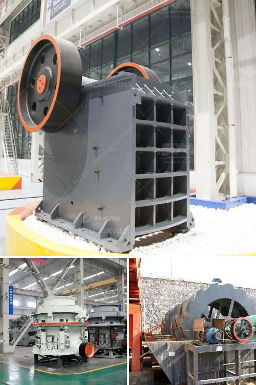

<h3>Why is there screening after crushing?</h3>
When it comes to the process of crushing materials for various purposes, screening is an integral step in ensuring the quality and consistency of the final product. Screening involves separating the crushed material into different sized particles, allowing for better control and utilization of the material. This process plays a crucial role in numerous industries such as mining, construction, and recycling. In this article, we will explore the reasons why there is screening after crushing, highlighting its importance and benefits.

One of the main reasons for screening after crushing is to ensure the desired particle size of the final product. Different industries have specific requirements for the size and consistency of crushed materials. By screening the crushed material, it is possible to separate it into various sizes or grades, thereby meeting the specific needs of different applications. For example, in construction, fine materials may be required for making concrete, while coarser materials may be needed for road bases or foundations. By screening the crushed material, construction companies can obtain the size fractions they need, leading to better performance and quality of their products.

Another reason for screening is to remove impurities or unwanted elements from the crushed material. In the mining industry, for instance, ore is often crushed to extract valuable minerals. However, some impurities or gangue materials may also be present alongside the desired minerals. By screening the crushed ore, it is possible to separate these impurities, ensuring a purer and more valuable final product. Removing impurities is also relevant in recycling processes, where crushed materials may contain contaminants that need to be separated before further processing.

Additionally, screening after crushing helps to optimize the efficiency of downstream processes. After the initial crushing stage, there may be a need to further process the crushed material to obtain a refined product. For instance, in the production of aggregates for building materials, crushed stones may undergo further processing, such as washing or shaping. By screening the crushed material, it becomes easier to control and direct the subsequent processes, improving their efficiency and reducing the likelihood of errors or inconsistencies.

Moreover, screening after crushing can also enhance the overall productivity and cost-effectiveness of operations. By separating the crushed material into different sizes, it becomes possible to utilize the various fractions more efficiently. Smaller particles can be used for specific applications or sold as separate products, while larger particles can be processed differently. This maximizes the value and usage of the crushed material, optimizing resource utilization and minimizing waste. Additionally, by obtaining the desired sizes through screening, the amount of material that needs further processing may be reduced, saving time, energy, and costs.

In summary, screening after crushing is a crucial step in the material processing industry. It ensures the desired particle size, removes impurities, optimizes downstream processes, and improves overall productivity and cost-effectiveness. By understanding the importance of screening after crushing, industries can achieve better control over their material quality, meet specific requirements, and enhance their operations.
<h3>Contact us</h3><ul><li><strong>Whatsapp:&nbsp;<a href="https://wa.me/8613661969651">+8613661969651</a></strong></li><li><a href="https://swt.shibang-china.com/?git&amp;zhl&amp;Why is there screening after crushing"><strong>Online Service(chat now)</strong></a></li></ul><h3>Related</h3><ul><li><a href='Why is an impact crusher used to run limestone.md'>Why is an impact crusher used to run limestone?</a></li><li><a href='Why is coal crushed in power plants.md'>Why is coal crushed in power plants?</a></li><li><a href='Why fine material should not enter a jaw crusher.md'>Why fine material should not enter a jaw crusher?</a></li><li><a href='Why is a crusher section used in the cement industry.md'>Why is a crusher section used in the cement industry?</a></li><li><a href='Why is the crusher used in the coal mining area.md'>Why is the crusher used in the coal mining area?</a></li></ul>