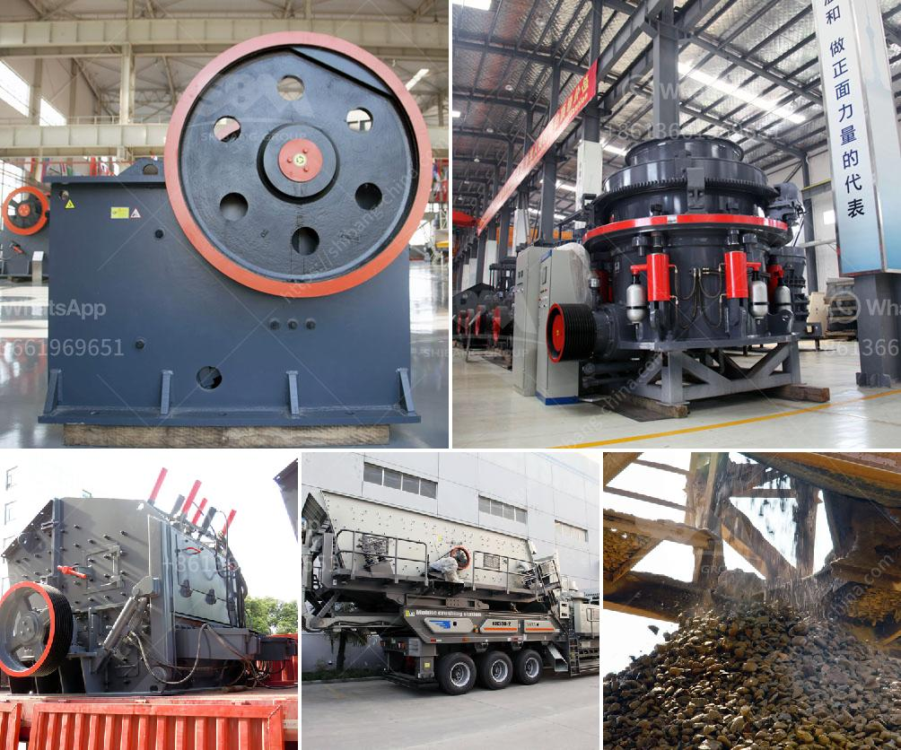

<h3>Why must cerussite(lead carbonate) be crushed?</h3>
Cerussite, also known as lead carbonate, is a mineral that occurs naturally in various parts of the world. It is a valuable source of lead and is mainly used in the production of lead-acid batteries, ammunition, and protective coatings. However, before it can be processed and utilized, cerussite undergoes a crucial step – crushing. In this article, we will explore why the crushing of cerussite is necessary and the benefits it brings to its overall usability.

The process of crushing cerussite involves reducing its size through mechanical means such as using crushers or pulverizers. This step is essentially the beginning of the entire processing operation, as the crushed material then goes through subsequent stages of beneficiation, separation, and purification to extract lead metal or obtain lead carbonate of a specific grade.

There are several key reasons why cerussite must be crushed. Firstly, crude cerussite often contains impurities and unwanted elements that are detrimental to its quality and suitability for further processing. These impurities can include other minerals, rocks, debris, or even larger pieces of cerussite that are not suitable for use. By crushing the mineral, these impurities are broken down and separated, thereby increasing the purity of the final product. This ensures that only the most suitable and usable material is used in subsequent stages of processing.

Secondly, cerussite typically occurs in large crystal formations or as aggregates. These crystal formations present challenges in terms of their handling, transportation, and even chemical reactions during the processing stages. By reducing the cerussite into smaller and more uniform particles, the material becomes easier to handle and process. This allows for better control over the reactions and ensures a more consistent and reliable output.

Additionally, crushing cerussite helps to increase its surface area. This is important because many chemical reactions take place on the surface of the particles. By breaking down large crystals into smaller pieces, we expose a greater surface area for reactions to occur, thus improving the efficiency of subsequent chemical processes such as leaching, roasting, or smelting. This increased surface area also enhances the contact between cerussite and any chemicals or reagents used in the processing, thus promoting effective interactions and reactions.

Furthermore, crushing cerussite aids in achieving the desired particle size distribution. Depending on the specific application or industry, different particle size ranges may be required. By carefully controlling the crushing process, it is possible to produce cerussite particles of consistent size, ensuring that the end product meets the specifications and requirements of different users or industries. This control over particle size is crucial to ensure the optimal performance of cerussite in its various applications.

In conclusion, the process of crushing cerussite (lead carbonate) serves several important purposes that are essential for its overall usability and effectiveness. It helps to eliminate impurities, makes the material easier to handle, increases the surface area for chemical reactions, and enables control over particle size distribution. These benefits contribute to the production of high-quality cerussite that meets the requirements of different industries and applications. By understanding the importance of crushing cerussite, we can appreciate the extensive processing involved in transforming natural resources into valuable and versatile materials like lead carbonate.
<h3>Contact us</h3><ul><li><strong>Whatsapp:&nbsp;<a href="https://wa.me/8613661969651">+8613661969651</a></strong></li><li><a href="https://swt.shibang-china.com/?git&amp;zhl&amp;Why must cerussitelead carbonate be crushed"><strong>Online Service(chat now)</strong></a></li></ul><h3>Related</h3><ul><li><a href='Why must cerussitelead carbonate be crushed.md'>Why must cerussite(lead carbonate) be crushed?</a></li><li><a href='Why is manganese ore crushed.md'>Why is manganese ore crushed?</a></li><li><a href='Why is there less dust in a vertical roller mill.md'>Why is there less dust in a vertical roller mill?</a></li><li><a href='Why choke fed cone crusher.md'>Why choke fed cone crusher?</a></li><li><a href='Why is a vibrating screen used to send ore to a rock crusher.md'>Why is a vibrating screen used to send ore to a rock crusher?</a></li></ul>