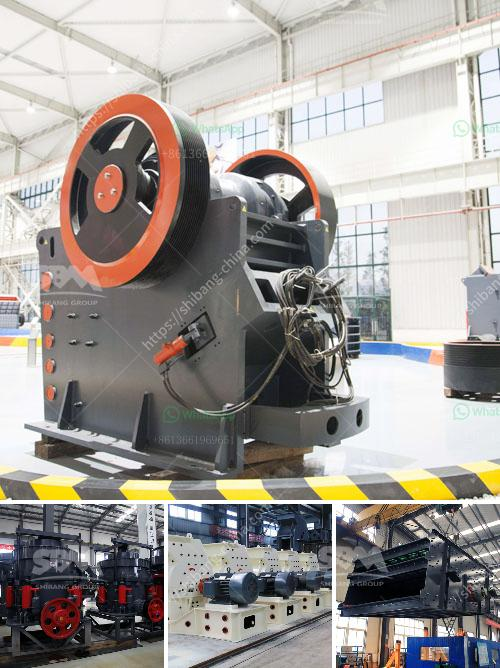

<h3>Why use a double-drive in a ball mill?</h3>
A ball mill is a grinding machine popular for grinding and mixing material together into powder form. The size of metal ore particles injected into the ball mill will affect the efficiency and performance of the ball mill. Regularly, a good grinding medium should be distributed evenly and allowed to work in the mill with competent speed.

One of the most commonly used methods to design ball mills is the double drive method. In this method, the motor, transmission, and electrical instrument use dual-drive double-pinion synchronous motors, thereby improving the efficiency of grinding. By utilizing two motors, it ensures that the load is evenly distributed and reduces the possibility of downtime due to an overload in one motor.

There are several advantages to using a double drive in a ball mill. Firstly, it allows for the transmission system to be paralleled, which means that each motor has the ability to independently drive the grinding medium. This enables the ball mill to work efficiently and smoothly, as one motor can stop or start while the other is still running.

Secondly, the double drive system provides higher power, torque, and speed control, resulting in an optimal grinding process. This is particularly beneficial when dealing with large capacity ball mills that require a high amount of power. The double drive system ensures that the mill operates at its maximum capacity without any performance limitations.

Furthermore, using a double drive also enhances the overall safety of the ball mill. In normal operation, if one motor fails or encounters an issue, the other motor can continue to operate, preventing any significant disruption in the grinding process. This redundant configuration eliminates the risk of sudden shutdowns and potential damage to the mill or other critical components.

Additionally, the double drive system provides better load sharing, leading to improved grinding efficiency. By evenly distributing the load between two motors, it minimizes the strain on each individual motor and prolongs their lifespan. Moreover, the parallel configuration allows for easier maintenance and troubleshooting as it simplifies identifying issues with the specific motor or transmission system.

In conclusion, using a double drive in a ball mill offers several significant advantages. It ensures the load is evenly distributed, enhances power, torque, and speed control, improves safety, and provides better load sharing. These benefits contribute to a more efficient and reliable grinding process, ultimately leading to higher productivity and reduced downtime. As a result, the double drive method is widely adopted in various industries that utilize ball mills for grinding and mixing various materials.
<h3>Contact us</h3><ul><li><strong>Whatsapp:&nbsp;<a href="https://wa.me/8613661969651">+8613661969651</a></strong></li><li><a href="https://swt.shibang-china.com/?git&amp;zhl&amp;Why use a doubledrive in a ball mill"><strong>Online Service(chat now)</strong></a></li></ul><h3>Related</h3><ul><li><a href='Why is an impact crusher used to run limestone.md'>Why is an impact crusher used to run limestone?</a></li><li><a href='Why fine material should not enter a jaw crusher.md'>Why fine material should not enter a jaw crusher?</a></li><li><a href='Why is the cone crusher known as a gyratory crusher.md'>Why is the cone crusher known as a gyratory crusher?</a></li><li><a href='Why are there advantages to crushing ore in the mining process.md'>Why are there advantages to crushing ore in the mining process?</a></li><li><a href='Why is a crusher section used in the cement industry.md'>Why is a crusher section used in the cement industry?</a></li></ul>