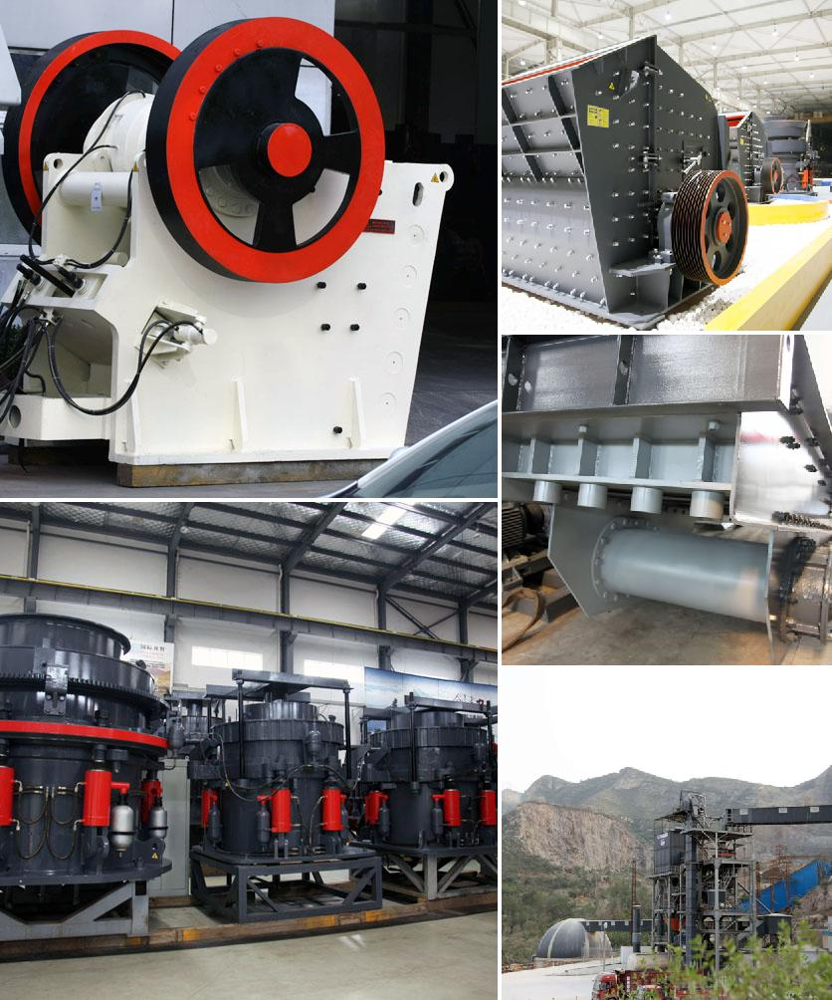

<h3>Why are there advantages to crushing ore in the mining process?</h3>
Mining is a complex and demanding industry that involves extracting valuable minerals or other geological materials from the earth. One of the critical steps in this process is crushing ore. Crushing plays a vital role in mining operations as it helps to separate the valuable minerals from waste materials, enabling efficient extraction and processing. This article highlights the advantages of crushing ore in the mining process.

First and foremost, crushing ore ensures a more efficient extraction process. Before minerals can be used or sold, they need to be separated from the surrounding waste rock or gangue. Crushing ore breaks the large rocks into smaller pieces, liberating the valuable minerals trapped within. This separation process significantly improves the efficiency of later steps in the mining process, such as grinding and flotation. By crushing ore, miners can extract a higher percentage of valuable minerals, making their operations more economically viable.

Moreover, crushing ore enhances the accessibility of valuable materials. Not all ores are easily accessible in their natural state. Many ores are located deep underground or in large deposits that cannot be readily extracted. In such cases, the process of crushing ore becomes crucial as it allows for easier access to the valuable minerals. Once the ore is crushed and broken down into smaller pieces, it becomes much more accessible for extraction through various techniques, such as drilling, blasting, or underground mining methods.

In addition to accessibility, crushing ore also improves the concentration of valuable minerals. By breaking down the ore into smaller particles, crushing increases the surface area available for chemical reactions to occur during subsequent processing stages. For example, after crushing, the ore can be ground into finer particles through processes like milling, enabling more efficient leaching or flotation. Increased surface area also promotes better adherence of chemicals and reagents, aiding in the separation of valuable minerals from gangue materials.

Furthermore, crushing ore contributes to waste reduction and environmental sustainability. Mining activities generate significant amounts of waste rock, tailings, and dust, which can have adverse environmental impacts. By crushing ore, miners can reduce the volume of waste materials produced during the mining process. Smaller particle sizes mean fewer waste materials, decreasing the amount of material that needs to be stored or disposed of. This reduction in waste helps alleviate environmental issues associated with mining, such as land degradation and contamination of water bodies.

Lastly, crushing ore enhances the safety of mining operations. By breaking down large rocks into smaller and more manageable pieces, the risk of rockfalls or accidents caused by unstable ground is minimized. Crushing also allows miners to remove potentially hazardous materials or impurities from the ore, reducing the health risks associated with handling and processing the raw materials.

In conclusion, crushing ore plays a crucial role in the mining process for several reasons. It improves the efficiency of mineral extraction, enhances accessibility, promotes concentration, reduces waste generation, and enhances safety. By understanding the advantages of crushing ore, mining companies can optimize their operations and maximize their profitability while minimizing environmental impacts.
<h3>Contact us</h3><ul><li><strong>Whatsapp:&nbsp;<a href="https://wa.me/8613661969651">+8613661969651</a></strong></li><li><a href="https://swt.shibang-china.com/?git&amp;zhl"><strong>Online Service(chat now)</strong></a></li></ul><h3>Related</h3><ul><li><a href='Why%20is%20there%20screening%20after%20crushing%3F.md'>Why is there screening after crushing?</a></li><li><a href='Why%20is%20an%20impact%20crusher%20used%20to%20run%20limestone%3F.md'>Why is an impact crusher used to run limestone?</a></li><li><a href='Why%20is%20it%20difficult%20to%20start%20a%20ball%20mill%3F.md'>Why is it difficult to start a ball mill?</a></li><li><a href='Why%20use%20trunnion%20bearings%20in%20cement%20mills%3F.md'>Why use trunnion bearings in cement mills?</a></li><li><a href='Why%20is%20vertical%20roller%20mill-based%20dry%20grinding%20not%20used%20in%20iron%20ore%20processing%3F.md'>Why is vertical roller mill-based dry grinding not used in iron ore processing?</a></li></ul>