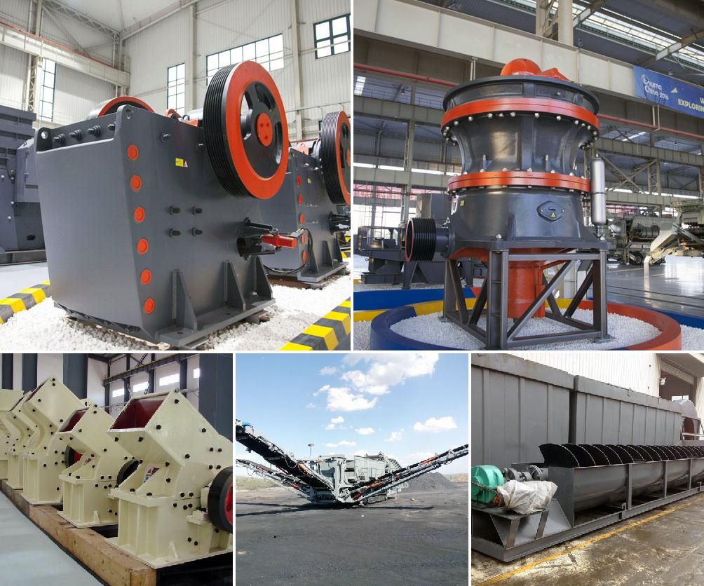

<h3>Why choke fed cone crusher?</h3>
Choke feeding a cone crusher should be avoided as it not only results in poor productivity and product shape, but it can also lead to higher operating costs and poor granulometric quality. However, for many crushing applications, where crushed materials are of a consistent feed size, and efficient production of material is desired, choke feeding a cone crusher becomes essential.

Choke feeding a cone crusher means maintaining a consistent feed of material into the chamber. This creates more rock-on-rock crushing action, which produces a superior shaped product with a more even distribution of particles. The result is a high-quality, cubical finished product that is well suited for use in industries such as construction, mining, and aggregates.

There are several reasons why choke feeding a cone crusher is vital for consistent production and optimal product shape. Firstly, it ensures the crusher is continuously fed with a consistent and appropriate amount of material. This helps to maximize the crusher's productivity, reducing downtime and improving overall efficiency. By avoiding the uneven feed distribution that can occur when using non-choke fed crushers, cone crushers can operate at their full potential, delivering high throughput rates and exceptional product quality.

Secondly, choke feeding a cone crusher prevents the formation of irregular-shaped particles. When a crusher is not choke fed, particles are usually crushed by compression, resulting in flat, elongated, or flaky-shaped particles. These irregular particles decrease the quality of the final product and can negatively affect its properties and usability. On the other hand, choke feeding results in more interparticle crushing, where particles are crushed between the crushing surfaces in the chamber. This produces more uniformly shaped particles, improving product consistency and providing better gradation control.

Furthermore, choke feeding a cone crusher can help reduce operating costs. As mentioned earlier, when a crusher is choke fed, it operates more efficiently, utilizing its full power potential. This means less energy is wasted and more tons per hour can be produced. Consequently, the cost per ton of the produced material decreases, making choke feeding an economically favorable option.

In conclusion, choke feeding a cone crusher offers numerous benefits for applications that require consistent feed size, high productivity, and excellent product shape. By maintaining a continuous and even feed of material, choke feeding ensures the crusher operates at its full capacity, resulting in reduced downtime, improved efficiency, and better product quality. Additionally, choke feeding helps to minimize irregular particle shapes, leading to a more uniform product gradation. Finally, choke feeding can help reduce operating costs by increasing production rates, resulting in a lower cost per ton of material produced. Thus, for optimal performance and cost-effective crushing, choke feeding a cone crusher is highly recommended.
<h3>Contact us</h3><ul><li><strong>Whatsapp:&nbsp;<a href="https://wa.me/8613661969651">+8613661969651</a></strong></li><li><a href="https://swt.shibang-china.com/?git&amp;zhl"><strong>Online Service(chat now)</strong></a></li></ul><h3>Related</h3><ul><li><a href='Why%20is%20manganese%20ore%20crushed%3F.md'>Why is manganese ore crushed?</a></li><li><a href='Why%20is%20a%20jaw%20crusher%20used%20to%20crush%20aluminum%20ore%3F.md'>Why is a jaw crusher used to crush aluminum ore?</a></li><li><a href='Why%20are%20there%20advantages%20to%20crushing%20ore%20in%20the%20mining%20process%3F.md'>Why are there advantages to crushing ore in the mining process?</a></li><li><a href='Why%20does%20the%20hopper%20need%20to%20be%20cleaned%20in%20the%20crusher%20plant%3F.md'>Why does the hopper need to be cleaned in the crusher plant?</a></li><li><a href='Why%20does%20the%20temperature%20of%20the%20mill%20grinding%20roller%20become%20high%3F.md'>Why does the temperature of the mill grinding roller become high?</a></li></ul>