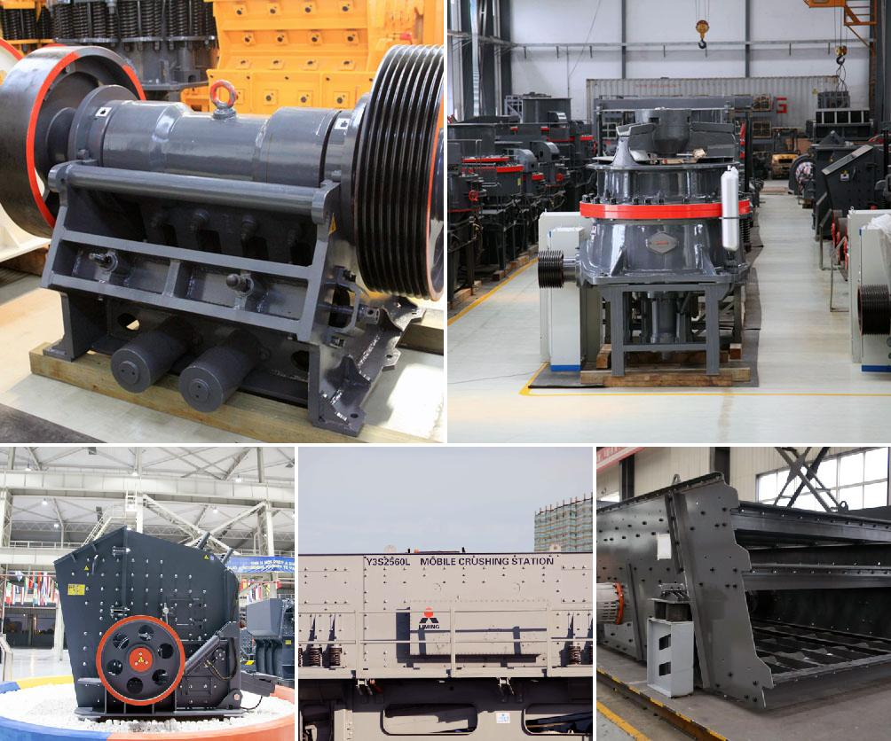

<h3>Why did iron ore beneficiation use the reverse flotation cell?</h3>
Iron ore beneficiation is the process of removing impurities from iron ore to achieve the desired purity and quality. The process involves several steps, such as crushing, grinding, separation, and purification. To produce high-grade iron ore concentrates, a reverse flotation separation process is used.

Reverse flotation is the most commonly used method in iron ore beneficiation. This process involves using a series of chemical additives to raise the pH of the ore slurry and reduce its negative attraction to water molecules. By doing so, the ore particles become hydrophobic, meaning they repel water, while the impurities remain hydrophilic, attracting water.

So why is the reverse flotation cell preferred for iron ore beneficiation? There are several key reasons:

1. Effective beneficiation: Reverse flotation is an effective method for removing silica and other impurities from iron ores in order to obtain a high-quality concentrate. It has been widely used in iron ore beneficiation due to its high efficiency and low cost.

2. Cleaner production: The reverse flotation process takes advantage of the characteristics of iron ore particles and impurities, allowing for a selective separation. This means that only the valuable iron ore particles are floated to the top, while the impurities sink to the bottom. As a result, the concentrate obtained is cleaner, with a higher iron content.

3. Reduced environmental impact: Reverse flotation is considered a greener beneficiation process compared to traditional methods. It minimizes the need for harmful chemicals and reagents, such as sodium cyanide and sodium hydroxide, which are commonly used in other ore beneficiation processes. By using less harmful additives and optimizing the process, the environmental impact is reduced.

4. Recovery of fine particles: Reverse flotation is particularly effective in recovering fine iron ore particles, which would otherwise be lost during the beneficiation process. Fine particles are often difficult to separate using traditional methods, as they tend to get lost in the water or end up in impurities. Reverse flotation improves the recovery of these valuable particles, maximizing the overall yield.

5. Flexibility and adaptability: The reverse flotation cell can be easily adapted to different types of iron ore, allowing for flexibility in the beneficiation process. It can handle both magnetite and hematite ores, as well as iron ore fines. Additionally, it can also be used for other minerals, such as phosphate, coal, and industrial minerals.

In conclusion, the reverse flotation cell is widely used in iron ore beneficiation due to its high efficiency, cleaner production, reduced environmental impact, and ability to recover fine particles. As the demand for high-grade iron ore continues to rise, the reverse flotation process will play an increasingly important role in meeting these demands while minimizing environmental impact.
<h3>Contact us</h3><ul><li><strong>Whatsapp:&nbsp;<a href="https://wa.me/8613661969651">+8613661969651</a></strong></li><li><a href="https://swt.shibang-china.com/?git&amp;zhl"><strong>Online Service(chat now)</strong></a></li></ul><h3>Related</h3><ul><li><a href='Why%20is%20an%20impact%20crusher%20used%20to%20run%20limestone%3F.md'>Why is an impact crusher used to run limestone?</a></li><li><a href='Why%20choke%20fed%20cone%20crusher%3F.md'>Why choke fed cone crusher?</a></li><li><a href='Why%20are%20carbon-forged%20balls%20used%20in%20ball%20mills%3F.md'>Why are carbon-forged balls used in ball mills?</a></li><li><a href='Why%20are%20there%20advantages%20to%20crushing%20ore%20in%20the%20mining%20process%3F.md'>Why are there advantages to crushing ore in the mining process?</a></li><li><a href='Why%20is%20a%20vibrating%20screen%20used%20to%20send%20ore%20to%20a%20rock%20crusher%3F.md'>Why is a vibrating screen used to send ore to a rock crusher?</a></li></ul>