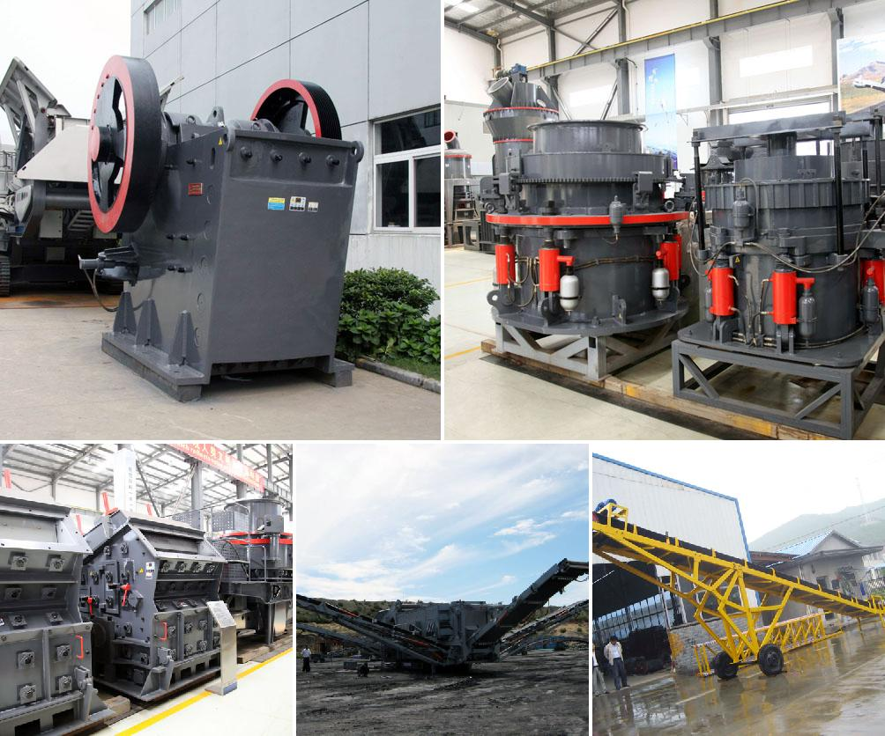

<h3>Why do you need a mobile stone crusher?</h3>
In today's rapidly developing world, infrastructure is essential. Whether it is for roads, railways, harbors, airports, or buildings, the construction industry provides the foundation for a nation's economic growth. And at the heart of this industry lies the need for crushing equipment - specifically, a mobile stone crusher.

A mobile stone crusher, also known as a portable stone crusher or mobile rock crusher, is undoubtedly a great investment for any construction company. It utilizes a crusher to add further value to the material that is being processed, thereby providing the contractors with a cleaner, more valuable end-product.

One of the key benefits of a mobile stone crusher is the effectiveness and adaptability it offers. Whether you need to crush rocks, concrete, asphalt, or even bricks, the machine can handle it efficiently. With a highly portable design, workers can easily transport the machine to different job sites without any hassle. This flexibility ensures that even in remote locations where construction is taking place, the project can progress smoothly without delays.

Another significant advantage of a mobile stone crusher is its versatility. These machines are capable of crushing a wide range of materials, including hard rocks and even glass. This adaptability makes them highly suitable for various projects, regardless of their complexity. Additionally, a mobile stone crusher can also be utilized in recycling operations, enabling the recycling of concrete, asphalt, and other construction materials. This translates into cost savings for construction companies and contributes to a more sustainable environment.

Furthermore, mobile stone crushers offer high levels of automation, reducing the need for manual intervention to a great extent. This not only enhances worker safety but also improves productivity and efficiency on-site. The advanced technology present in these machines allows for precise control of the crushing process, resulting in consistent and uniform-sized aggregates. Moreover, the latest models of mobile stone crushers are equipped with intelligent systems that monitor the equipment's performance in real-time. This ensures timely maintenance and troubleshooting, minimizing downtime and optimizing production.

Lastly, a mobile stone crusher provides a cost-effective solution for contractors. It eliminates the need for expensive transportation and allows contractors to produce materials on-site, reducing transportation costs significantly. Moreover, mobile stone crushers usually have lower operating costs compared to fixed crushers, making them an attractive option for construction companies looking to maximize their profitability.

In conclusion, a mobile stone crusher is an essential piece of equipment for any construction company. Its adaptability, versatility, automation, and cost-effectiveness make it a wise investment that can improve the efficiency and profitability of construction projects. With the ability to process various materials and its easily transportable design, a mobile stone crusher offers the convenience and flexibility required in today's fast-paced construction industry. So, if you want to stay competitive and take your construction projects to the next level, acquiring a mobile stone crusher is undoubtedly a wise decision.
<h3>Contact us</h3><ul><li><strong>Whatsapp:&nbsp;<a href="https://wa.me/8613661969651">+8613661969651</a></strong></li><li><a href="https://swt.shibang-china.com/?git&amp;zhl"><strong>Online Service(chat now)</strong></a></li></ul><h3>Related</h3><ul><li><a href='Why%20does%20the%20temperature%20of%20the%20mill%20grinding%20roller%20become%20high%3F.md'>Why does the temperature of the mill grinding roller become high?</a></li><li><a href='Why%20does%20a%20steel%20plant%20need%20a%20slag%20processing%20plant%3F.md'>Why does a steel plant need a slag processing plant?</a></li><li><a href='Why%20is%20artificial%20sand%20used%3F.md'>Why is artificial sand used?</a></li><li><a href='Why%20are%20classifiers%20used%20in%20ball%20mills%3F.md'>Why are classifiers used in ball mills?</a></li><li><a href='Why%20is%20it%20difficult%20to%20start%20a%20ball%20mill%3F.md'>Why is it difficult to start a ball mill?</a></li></ul>