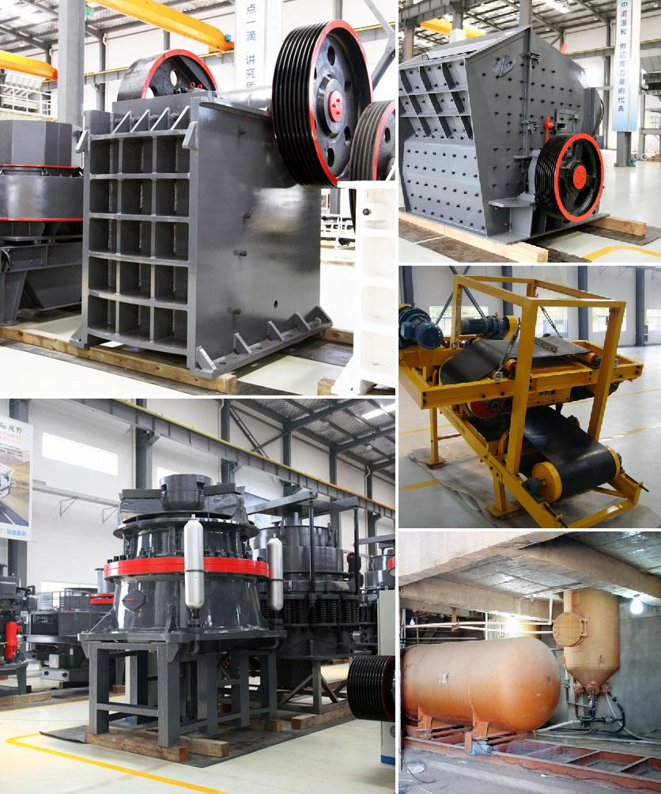

<h3>Why does a ball mill start slowly?</h3>
A ball mill is a crucial piece of equipment used for crushing and grinding materials in various industries, such as cement, silicate, new building materials, refractory materials, fertilizers, ferrous and non-ferrous metal beneficiation, and glass ceramics. However, one common problem many operators encounter is the slow start-up of the ball mill. This can be frustrating and lead to productivity loss. So, why does a ball mill start slowly? Let's explore some possible reasons.

1. Insufficient power supply: In some cases, the power supply to the ball mill may be inadequate, causing it to start slowly. The motor that powers the mill may not be receiving the required voltage, leading to a sluggish start-up. It is essential to ensure that the power supply meets the mill's specifications to prevent this issue.

2. Mechanical issues: Mechanical problems with the ball mill, such as misalignment, loose components, or worn-out gears, could result in a slow start. These issues could interfere with the smooth rotation of the mill, causing it to struggle during start-up. Regular maintenance and inspection of the mill can help identify and address these mechanical problems timely.

3. Lack of lubrication: Another reason for slow start-up could be inadequate lubrication. The ball mill's moving parts, such as the bearings and gears, require proper lubrication to minimize friction and ensure smooth operation. If there is a lack of lubrication or the lubricant is contaminated, the mill may face difficulties starting up quickly.

4. Excessive material load: When a ball mill is overloaded with excessive material, it can strain the motor and cause slow start-up. Overloading the mill leads to increased energy consumption, which may result in the motor not being able to start at the desired speed. Proper control of the material feed rate can help prevent this problem.

5. Inefficient cooling system: Ball mills generate significant heat during operation, and an efficient cooling system is crucial to maintain optimal operating conditions. If the cooling system is inadequate or malfunctioning, the excessive heat can negatively impact the mill's start-up speed. Regular inspection and maintenance of the cooling system can prevent overheating and ensure a smooth start-up.

6. Belt slippage: The transmission belt connects the motor to the ball mill. If the belt is worn out, loose, or slipping, it can lead to a slow start. Belt slippage reduces the power transmission efficiency and affects the mill's acceleration during start-up. Regular inspection and replacement of worn-out belts can prevent this issue.

Addressing the slow start-up of a ball mill is crucial for maintaining productivity and preventing equipment damage. By identifying and addressing the root causes, operators can effectively resolve this problem. Regular maintenance, inspection, and adhering to the manufacturer's recommendations can significantly contribute to the smooth and efficient operation of a ball mill.
<h3>Contact us</h3><ul><li><strong>Whatsapp:&nbsp;<a href="https://wa.me/8613661969651">+8613661969651</a></strong></li><li><a href="https://swt.shibang-china.com/?git&amp;zhl"><strong>Online Service(chat now)</strong></a></li></ul><h3>Related</h3><ul><li><a href='Why%20are%20there%20advantages%20to%20crushing%20ore%20in%20the%20mining%20process%3F.md'>Why are there advantages to crushing ore in the mining process?</a></li><li><a href='Why%20is%20vertical%20roller%20mill-based%20dry%20grinding%20not%20used%20in%20iron%20ore%20processing%3F.md'>Why is vertical roller mill-based dry grinding not used in iron ore processing?</a></li><li><a href='Why%20choke%20fed%20cone%20crusher%3F.md'>Why choke fed cone crusher?</a></li><li><a href='Why%20is%20ash%20removed%20in%20a%20coal%20preparation%20plant%3F.md'>Why is ash removed in a coal preparation plant?</a></li><li><a href='Why%20is%20there%20screening%20after%20crushing%3F.md'>Why is there screening after crushing?</a></li></ul>