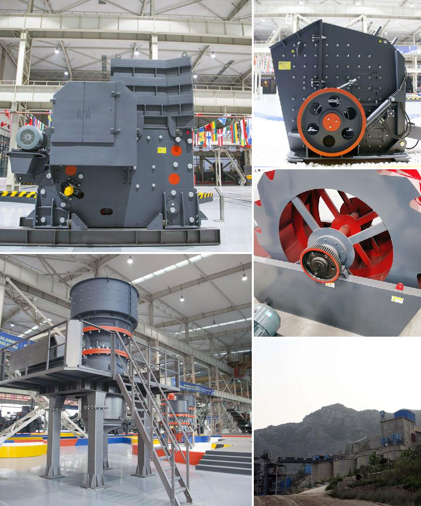

<h3>Why does a belt conveyor vibrate?</h3>
Belt conveyors are widely used in various industries for efficient material handling. They provide a means of transporting goods and materials from one place to another, saving time and increasing productivity. However, on occasion, these conveyor systems can experience vibrations, which can be concerning for operators. Understanding the potential causes of conveyor vibrations is essential to address the issue and ensure uninterrupted operations.

One of the primary causes of conveyor vibrations is improper belt tensioning. If the belt is either too loose or too tight, it can result in vibrations during operation. Loose belts can slip or bounce on the rollers, causing the entire system to vibrate. On the other hand, tightly tensioned belts can create excessive pressure on the rollers, leading to a vibrating motion.

Another common cause of conveyor vibrations is misalignment. Belt misalignment occurs when the belt is not properly centered on the rollers and pulleys. This can happen due to an uneven load, worn out rollers, or improper installation. As a result, the misaligned belt can rub against the frame or other components, causing vibrations that can reverberate throughout the entire conveyor system.

Furthermore, worn or damaged idler rollers can also contribute to conveyor vibrations. Over time, the rollers can become worn out or unevenly worn due to continuous use or inadequate maintenance. When the belt comes into contact with these damaged rollers, it can lead to irregular motion and vibrations. Regular inspection and replacement of worn rollers can help prevent such issues.

Inadequate lubrication can also contribute to conveyor vibrations. Insufficient lubrication between the belt and the rollers can cause increased friction, leading to vibrations. It is essential to apply the appropriate amount and type of lubricant to ensure smooth operation and minimize vibrations.

Additionally, excessive material buildup on the belt or within the conveyor system can result in vibrations. Over time, dust, debris, or sticky substances can accumulate on the belt and rollers, altering the balance and causing vibrations. Regular cleaning and maintenance of the conveyor system are crucial to prevent the buildup of materials and maintain optimal functioning.

External factors such as uneven floors or improper installation can also contribute to conveyor vibrations. If the conveyor is not securely mounted on a stable surface or if the floor is not level, it can cause the system to shake and vibrate during operation. It is necessary to ensure proper installation and address any issues with the flooring to reduce vibrations.

In conclusion, several factors can contribute to the vibrations experienced in belt conveyors. They include improper belt tensioning, misalignment, worn or damaged rollers, inadequate lubrication, material buildup, and external factors such as uneven floors or improper installation. Regular inspection, maintenance, and proper alignment of the belt and rollers are vital to prevent and address these issues. Addressing the underlying causes of vibrations will not only ensure smooth and efficient operation but also enhance the overall lifespan of the conveyor system.
<h3>Contact us</h3><ul><li><strong>Whatsapp:&nbsp;<a href="https://wa.me/8613661969651">+8613661969651</a></strong></li><li><a href="https://swt.shibang-china.com/?git&amp;zhl"><strong>Online Service(chat now)</strong></a></li></ul><h3>Related</h3><ul><li><a href='Why%20does%20the%20temperature%20of%20the%20mill%20grinding%20roller%20become%20high%3F.md'>Why does the temperature of the mill grinding roller become high?</a></li><li><a href='Why%20is%20a%20vibrating%20screen%20used%20to%20send%20ore%20to%20a%20rock%20crusher%3F.md'>Why is a vibrating screen used to send ore to a rock crusher?</a></li><li><a href='Why%20are%20carbon-forged%20balls%20used%20in%20ball%20mills%3F.md'>Why are carbon-forged balls used in ball mills?</a></li><li><a href='Why%20is%20manganese%20jaw%20used%20in%20a%20crusher%3F.md'>Why is manganese jaw used in a crusher?</a></li><li><a href='Why%20use%20a%20double-drive%20in%20a%20ball%20mill%3F.md'>Why use a double-drive in a ball mill?</a></li></ul>