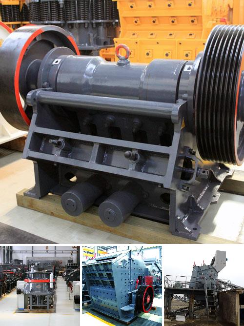

<h3>Why fine material should not enter a jaw crusher?</h3>
A jaw crusher is an essential piece of equipment for any mining or ore processing operation. It is primarily used as a primary crusher to reduce and fragment the material before it passes through the downstream process. However, one crucial aspect that often gets overlooked is the feed material's size and composition.

The jaw crusher's purpose is to break down large rocks into smaller pieces, typically reducing them to gravel-sized particles. It achieves this through a series of mechanical forces exerted on these rocks, including compression, shear, and impact. However, when fine material enters the jaw crusher, it can cause a range of problems that will ultimately affect the efficiency and productivity of the entire operation.

One of the primary issues caused by the presence of fine material in a jaw crusher is the increased wear and tear on the machine's components. The fine particles act as abrasives, abrading the metal surfaces of the jaw crusher. This can lead to premature failures of the bearings, liner plates, and other vulnerable parts, resulting in unplanned downtime, increased maintenance costs, and reduced overall lifespan of the equipment.

Furthermore, fine material can also cause jamming and blockages within the jaw crusher's chamber. As the fine particles accumulate and compact, they can restrict the flow of material through the crusher, causing it to clog. This can lead to reduced throughput and production rates, as well as increased energy consumption as the crusher struggles to push the material through.

Moreover, the presence of fine material in the jaw crusher can also impact the end product quality. Fine particles have a tendency to adhere to the larger rock fragments, leading to an increase in the production of fines. This can result in a product with higher content of undesirable fines, reducing its market value and potentially requiring additional processing steps to meet the desired specifications.

To prevent these issues, it is crucial to properly screen and size the material before feeding it into the jaw crusher. By using a grizzly screen, for example, oversize material can be efficiently separated, ensuring that only the appropriate size of material enters the crusher. This not only enhances the overall efficiency of the operation but also reduces the chances of equipment damage and production disruptions caused by fine material.

In conclusion, the presence of fine material in a jaw crusher can have detrimental effects on the equipment, productivity, and end product quality. It is essential to properly screen and size the material before feeding it into the crusher to prevent these issues. By doing so, mining and ore processing operations can maximize their efficiency, minimize downtime, and optimize the overall performance of their jaw crushers.
<h3>Contact us</h3><ul><li><strong>Whatsapp:&nbsp;<a href="https://wa.me/8613661969651">+8613661969651</a></strong></li><li><a href="https://swt.shibang-china.com/?git&amp;zhl"><strong>Online Service(chat now)</strong></a></li></ul><h3>Related</h3><ul><li><a href='Why%20is%20a%20jaw%20crusher%20used%20to%20crush%20aluminum%20ore%3F.md'>Why is a jaw crusher used to crush aluminum ore?</a></li><li><a href='Why%20does%20a%20steel%20plant%20need%20a%20slag%20processing%20plant%3F.md'>Why does a steel plant need a slag processing plant?</a></li><li><a href='Why%20use%20trunnion%20bearings%20in%20cement%20mills%3F.md'>Why use trunnion bearings in cement mills?</a></li><li><a href='Why%20use%20an%20impact%20crusher%20instead%20of%20other%20crushers%3F.md'>Why use an impact crusher instead of other crushers?</a></li><li><a href='Why%20does%20a%20ball%20mill%20start%20slowly%3F.md'>Why does a ball mill start slowly?</a></li></ul>