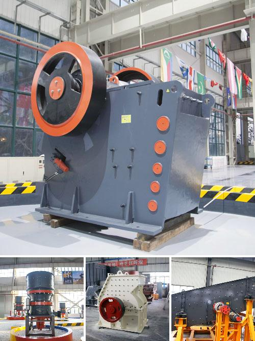

<h3>Why is an impact crusher used to run limestone?</h3>
Limestone is widely used in construction projects because of its abundant availability, high durability, and versatility. Crushed limestone aggregates are used as a base material for several roads, driveways, and parking lots. It is also used for water drainage systems and to enhance the stability of soil in agriculture fields. The demand for limestone in various industries makes it essential to crush the raw material into small particles, making it easier to utilize.

One of the key machinery used to crush limestone is an impact crusher. Impact crushers play an important role in limestone crushing operations. Due to its wide use in the construction industry, limestone has a significant impact on the environment, which must be carefully managed. Many quarries and mines have discovered the benefits of using impact crushers to further process limestone.

An impact crusher uses impacting forces to break down the raw material into smaller pieces. It is designed to handle materials with a high volume of hardness and abrasiveness. The key feature of an impact crusher is its ability to produce a high-quality shape of finished product, without the need for additional screening or grading processes. This makes it ideal for limestone crushing applications.

The primary purpose of using an impact crusher is to create a "cubical" product shape. When limestone is crushed using an impact crusher, the aggregate particles are broken along their natural cleavage lines, resulting in a more cubical product, which is desirable for many construction applications. The cubical shape ensures better interlocking and adherence to other materials, providing improved stability and durability.

Furthermore, impact crushers have a high reduction ratio, which means they can accept larger feed sizes and produce smaller output sizes. This is advantageous when crushing limestone, as it allows for more efficient processing and reduces the need for multiple crushing stages. By reducing the number of stages required, impact crushers save both time and costs for the operators.

Another benefit of using an impact crusher for limestone crushing is its ability to provide consistent particle size distribution. This is particularly important for certain industries, such as asphalt production. The consistent particle size allows for a uniform mixture of limestone and other aggregates, resulting in a higher quality asphalt product. Impact crushers can also produce manufactured sand, which can be used as a substitute for natural sand in concrete production.

Additionally, impact crushers are relatively easy to maintain compared to other crushing equipment. They have fewer moving parts and require less lubrication, reducing downtime and maintenance costs. Many impact crusher designs also feature adjustable breaker plates, which can be easily replaced or adjusted to control the size of the crushed material.

In summary, an impact crusher is used to crush limestone due to its ability to produce a cubical shape of finished product, high reduction ratio, consistent particle size distribution, and ease of maintenance. These features make an impact crusher an ideal choice for limestone crushing in various construction applications. By efficiently crushing limestone, impact crushers contribute to sustainable mining practices while maximizing the value of this versatile material.
<h3>Contact us</h3><ul><li><strong>Whatsapp:&nbsp;<a href="https://wa.me/8613661969651">+8613661969651</a></strong></li><li><a href="https://swt.shibang-china.com/?git&amp;zhl"><strong>Online Service(chat now)</strong></a></li></ul><h3>Related</h3><ul><li><a href='Why%20does%20the%20lubricating%20oil%20pressure%20increase%20in%20a%20cone%20crusher%3F.md'>Why does the lubricating oil pressure increase in a cone crusher?</a></li><li><a href='Why%20is%20track%20mounted%20crushing%20plant%20at%20the%20pit%20rather%20than%20fixed%20plant%3F.md'>Why is track mounted crushing plant at the pit rather than fixed plant?</a></li><li><a href='Why%20are%20classifiers%20used%20in%20ball%20mills%3F.md'>Why are classifiers used in ball mills?</a></li><li><a href='Why%20is%20a%20cyclone%20required%20in%20a%20cement%20ball%20mill%3F.md'>Why is a cyclone required in a cement ball mill?</a></li><li><a href='Why%20does%20a%20ball%20mill%20start%20slowly%3F.md'>Why does a ball mill start slowly?</a></li></ul>