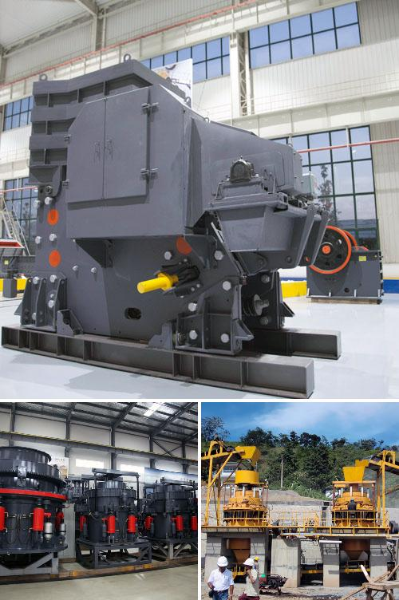

<h3>Why is artificial sand used?</h3>
In recent years, the demand for construction materials has been on the rise, owing to rapid urbanization and the need for infrastructure development. Sand, as one of the crucial components in the construction industry, is extensively used for various purposes such as making concrete, filling beaches, leveling surfaces, and manufacturing bricks. However, due to the environmental concerns associated with excessive sand mining, the use of artificial sand has become increasingly prevalent. Artificial sand, which is also known as crushed sand or engineered sand, has gained traction among builders and developers as an alternative to natural sand. Let us delve into the reasons why artificial sand is used.

First and foremost, artificial sand serves as a sustainable and eco-friendly solution. Owing to the depletion of riverbeds and excessive mining, the natural sand supply is becoming scarce, thereby leading to a rise in its prices. Moreover, indiscriminate sand mining can have detrimental effects on the environment such as damaging river ecosystems, disturbing aquatic life, and causing erosion of riverbanks. Using artificial sand, on the other hand, mitigates these environmental concerns as it is manufactured from industrial waste materials like quarry dust, fly ash, and solid waste, thus reducing the strain on natural resources and minimizing the environmental impact.

Secondly, artificial sand offers better quality and consistency compared to natural sand. While natural sand may vary in composition and gradation due to different geological factors, artificial sand can be manufactured with specific characteristics and size distribution to suit various requirements. This uniformity and control in particle size allow for better workability, strength, and durability of the construction material. The superior quality of artificial sand makes it an ideal choice for high-strength concrete, plastering, and other construction activities.

Furthermore, artificial sand helps overcome the issue of shortage and inconsistency in natural sand supply. Construction projects often require a large quantity of sand, and natural sand reserves may not be able to meet this demand. By using artificial sand, builders have a reliable and consistent source that can be utilized in any quantity, eliminating the risk of supply shortages and price fluctuations.

In addition, artificial sand is free from impurities such as silt and clay, which are commonly found in natural sand. These impurities can adversely affect the workability, setting time, and strength of concrete. By using artificial sand, the quality and performance of concrete can be significantly improved, leading to better structural integrity and longevity of buildings.

Finally, the use of artificial sand contributes to cost savings. As natural sand becomes scarce, its prices tend to rise. In contrast, artificial sand can be produced at a lower cost using waste materials, and the production process can be tailored to meet specific requirements, resulting in reduced costs and increased affordability for builders and developers.

In conclusion, the utilization of artificial sand has become imperative in the construction industry due to the scarcity of natural sand, environmental concerns, better quality control, consistent supply, and cost savings. As the demand for construction materials continues to grow, it is crucial to explore sustainable alternatives like artificial sand to meet the needs of the industry while preserving the environment for future generations.
<h3>Contact us</h3><ul><li><strong>Whatsapp:&nbsp;<a href="https://wa.me/8613661969651">+8613661969651</a></strong></li><li><a href="https://swt.shibang-china.com/?git&amp;zhl"><strong>Online Service(chat now)</strong></a></li></ul><h3>Related</h3><ul><li><a href='Why%20is%20the%20Quarry%20Act%20important%3F.md'>Why is the Quarry Act important?</a></li><li><a href='Why%20does%20the%20hopper%20need%20to%20be%20cleaned%20in%20the%20crusher%20plant%3F.md'>Why does the hopper need to be cleaned in the crusher plant?</a></li><li><a href='Why%20is%20there%20screening%20after%20crushing%3F.md'>Why is there screening after crushing?</a></li><li><a href='Why%20are%20carbon-forged%20balls%20used%20in%20ball%20mills%3F.md'>Why are carbon-forged balls used in ball mills?</a></li><li><a href='Why%20is%20an%20impact%20crusher%20used%20to%20run%20limestone%3F.md'>Why is an impact crusher used to run limestone?</a></li></ul>