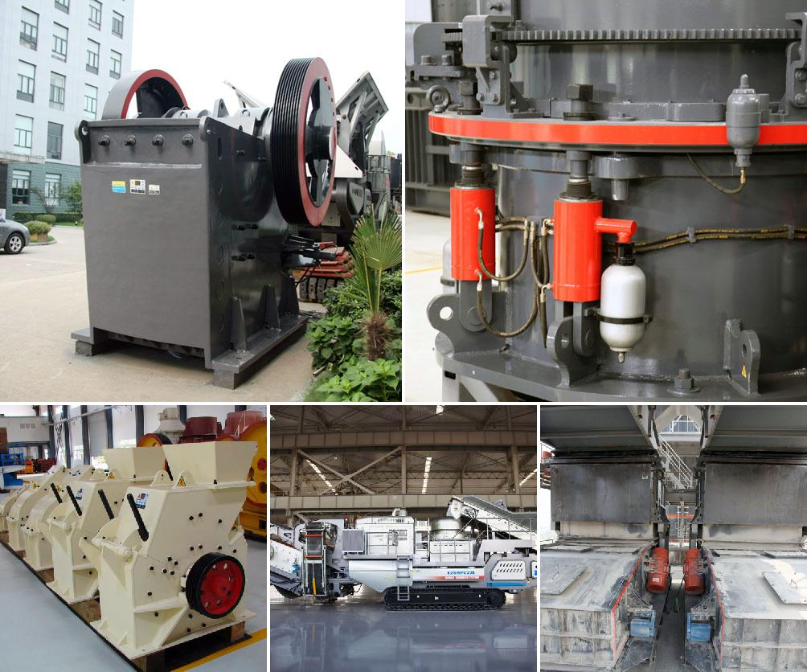

<h3>Why is ball milling a nonequilibrium process?</h3>
Ball milling is a technique used to reduce the particle size of materials and mix them thoroughly. It is an essential process in many industries, including the mining, chemical, and pharmaceutical sectors. Ball milling involves the grinding of materials in a rotating cylindrical chamber, leading to the creation of a fine powder.

One of the key characteristics of ball milling is that it is a nonequilibrium process. Unlike other mechanical processes, such as cutting or grinding, which reach equilibrium when the forces applied to the material balance out, ball milling is a dynamic process that continuously introduces new energy into the system.

During ball milling, the grinding media (typically balls or rods) collide with the material, causing mechanical deformation and breaking down the particles. This collision energy leads to various phenomena that contribute to the nonequilibrium nature of ball milling.

Firstly, the impact forces between the balls and the material cause local heating. These high-energy collisions generate substantial heat, leading to an increase in the material's temperature. This rise in temperature and the associated thermal energy can result in significant changes in the material's properties, including the formation of new phases or chemical reactions.

Secondly, the repetitive mechanical deformation induced by the collisions can lead to strain hardening of the material. Strain hardening occurs when a material becomes harder and stronger due to plastic deformation. This process can result in a fine dispersion of dislocations within the material, which hinder further deformation. Consequently, the material's mechanical properties are altered, making it distinct from its original equilibrium state.

Furthermore, the continuous grinding action of the mill impacts the crystal structure of the material. High-energy ball milling can induce structural changes, such as lattice defects, grain refinement, and amorphization. This alteration in the material structure further distinguishes ball milling as a nonequilibrium process.

Moreover, ball milling is accompanied by varying degrees of shear deformation. The shear forces experienced by the material during milling can lead to particle fragmentation, formation of new surfaces, and alterations in the material's morphology. Thus, the cohesive forces between the particles are disrupted, and the material's original equilibrium configuration is disturbed.

In addition to the above mechanical effects, ball milling can also promote nonequilibrium chemical reactions. The high-energy collisions between the grinding media and the material increase the chemical reactivity, facilitating chemical transformations that would not occur under normal equilibrium conditions. This opens up new avenues for synthesis and modification of materials, making ball milling a valuable technique in materials science.

In conclusion, ball milling is a nonequilibrium process due to several factors. The impact forces, local heating, strain hardening, structural changes, shear deformation, and chemical reactions induced during ball milling all contribute to the dynamic nature of the process. Understanding and leveraging these nonequilibrium effects allows for the tailoring of material properties and the development of novel materials with enhanced characteristics.
<h3>Contact us</h3><ul><li><strong>Whatsapp:&nbsp;<a href="https://wa.me/8613661969651">+8613661969651</a></strong></li><li><a href="https://swt.shibang-china.com/?git&amp;zhl"><strong>Online Service(chat now)</strong></a></li></ul><h3>Related</h3><ul><li><a href='Why%20must%20cerussite%28lead%20carbonate%29%20be%20crushed%3F.md'>Why must cerussite(lead carbonate) be crushed?</a></li><li><a href='Why%20is%20manganese%20jaw%20used%20in%20a%20crusher%3F.md'>Why is manganese jaw used in a crusher?</a></li><li><a href='Why%20is%20an%20impact%20crusher%20used%20to%20run%20limestone%3F.md'>Why is an impact crusher used to run limestone?</a></li><li><a href='Why%20is%20coal%20crushed%20in%20power%20plants%3F.md'>Why is coal crushed in power plants?</a></li><li><a href='Why%20should%20we%20use%20aggregate%20washing%20systems%3F.md'>Why should we use aggregate washing systems?</a></li></ul>