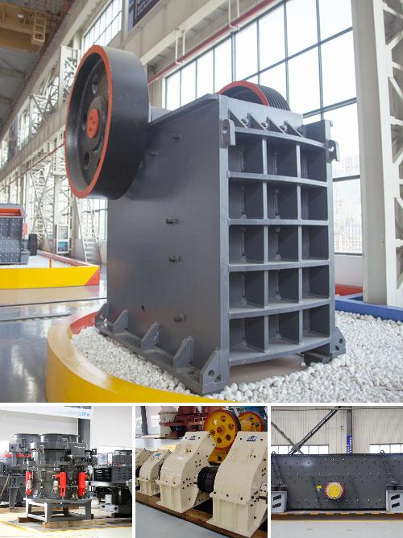

<h3>Why is manganese ore crushed?</h3>
Manganese ore is a crucial resource used in various industries such as the steel and battery sectors. It is primarily mined in open-pit operations, and once extracted, it undergoes several steps before it can be utilized effectively. One of these essential steps is crushing the manganese ore.

Manganese ore is crushed to facilitate the separation of valuable minerals from waste material during processing. The crushing stage is particularly important as it prepares the ore for further beneficiation processes, increasing its economic value. This article will explore the reasons why manganese ore is crushed and its significance in the extraction and utilization of this valuable resource.

One of the main objectives of crushing manganese ore is to reduce large-sized rocks into smaller particles. This process, typically done through mechanical means, allows for improved accessibility to the valuable minerals present within the ore. By breaking down the ore into smaller fragments, it becomes easier to separate the valuable material from the waste during subsequent processing stages.

Additionally, crushing manganese ore promotes efficient and effective mineral liberation. Mineral liberation refers to the breaking apart of the ore particles, freeing the valuable minerals from the gangue or waste material that surrounds them. This liberation is crucial in order to maximize the recovery of valuable minerals during subsequent beneficiation processes, such as gravity separation or flotation. By reducing the size of the ore particles, crushing enhances the exposure of valuable minerals, increasing the chances of successful liberation.

Moreover, crushing manganese ore aids in improving the ore's overall consistency and homogeneity. This process ensures that the manganese ore has a uniform particle size, which is crucial for achieving reliable and consistent results during beneficiation processes. Homogeneous ore particles have a higher likelihood of being evenly distributed during subsequent processing, promoting efficient and effective extraction of valuable minerals.

Another important reason for crushing manganese ore is to optimize the ore's surface area-to-volume ratio. By reducing the size of the ore particles, the overall surface area of the ore increases significantly. This increased surface area allows for enhanced interactions between the ore and any chemicals or reagents used during beneficiation processes. It also facilitates improved contact between the ore and leaching agents in hydrometallurgical processes, such as solvent extraction or leaching.

Furthermore, crushing manganese ore plays a crucial role in reducing transportation costs. Once the ore is crushed, it can be easily transported over long distances, facilitating its efficient movement from the mining site to the processing plant. Removing the need to transport large rocks or boulders minimizes logistics expenses and improves the overall economic viability of manganese ore extraction.

In conclusion, crushing manganese ore is an integral step in the extraction and utilization of this valuable resource. It enables better accessibility, improved mineral liberation, and homogeneous particle size distribution. By optimizing the surface area-to-volume ratio and reducing transportation costs, crushing plays a critical role in maximizing the economic value of manganese ore. As the demand for manganese continues to grow, efficient and effective crushing processes are becoming increasingly important for the mining industry.
<h3>Contact us</h3><ul><li><strong>Whatsapp:&nbsp;<a href="https://wa.me/8613661969651">+8613661969651</a></strong></li><li><a href="https://swt.shibang-china.com/?git&amp;zhl"><strong>Online Service(chat now)</strong></a></li></ul><h3>Related</h3><ul><li><a href='Why%20is%20artificial%20sand%20used%3F.md'>Why is artificial sand used?</a></li><li><a href='Why%20use%20an%20impact%20crusher%20instead%20of%20other%20crushers%3F.md'>Why use an impact crusher instead of other crushers?</a></li><li><a href='Why%20is%20an%20impact%20crusher%20used%20to%20run%20limestone%3F.md'>Why is an impact crusher used to run limestone?</a></li><li><a href='Why%20is%20ball%20milling%20a%20nonequilibrium%20process%3F.md'>Why is ball milling a nonequilibrium process?</a></li><li><a href='Why%20does%20a%20steel%20plant%20need%20a%20slag%20processing%20plant%3F.md'>Why does a steel plant need a slag processing plant?</a></li></ul>