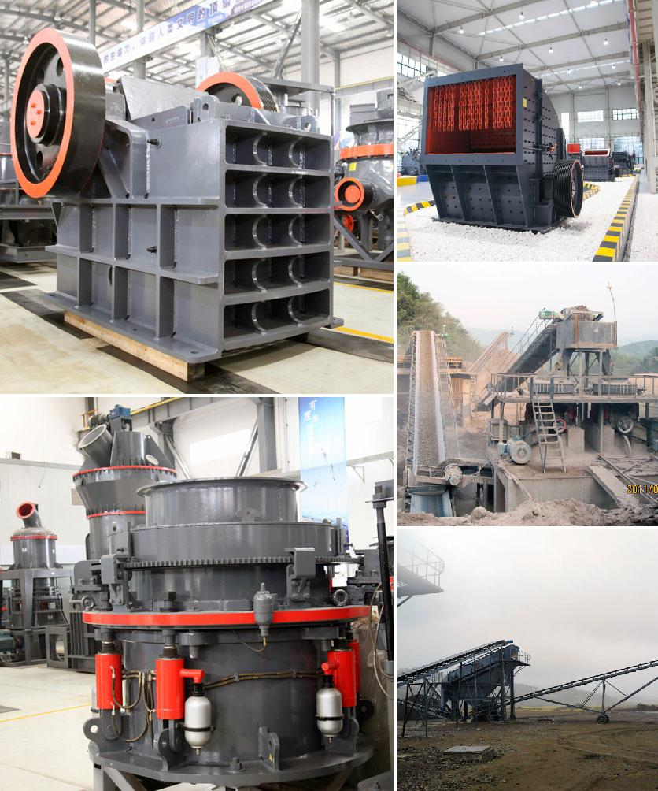

<h3>Why is the Quarry Act important?</h3>
Quarrying, the extraction of natural resources such as stone, sand, and minerals from the earth, is an essential industry that has been prevalent since ancient times. However, the operations involved in quarrying can be potentially hazardous and environmentally damaging if not regulated effectively. This is where legislation, such as the Quarry Act, plays a crucial role in safeguarding both human life and the environment.

The Quarry Act, also known as the Quarries Regulations 1999, is a piece of legislation in the United Kingdom that aims to ensure the safety of workers and protect the environment during quarrying operations. The Act imposes a range of legal duties on quarry owners, operators, and workers to ensure they follow safe practices while carrying out their activities.

One of the primary reasons why the Quarry Act is important is the protection it provides to workers in the industry. Quarries are inherently dangerous places given the nature of the work involved, which includes handling heavy machinery and explosives, as well as working in precarious environments such as rock faces. The Act establishes a comprehensive set of regulations to minimize the risk of accidents and injuries, demanding that quarries conduct thorough risk assessments, provide proper training for workers, and implement safety measures like protective equipment and warning signs. By adhering to these regulations, the Quarry Act greatly reduces the likelihood of accidents and creates a safer working environment for all involved.

Moreover, the Quarry Act recognizes the ecological significance of quarries. Quarries often bring about significant changes in the landscape, wildlife habitats, and water courses. If not managed correctly, the environmental impact of quarrying can be detrimental, leading to soil erosion, water pollution, and destruction of animal and plant species. The Act ensures that quarries operate in an environmentally responsible manner by requiring them to perform environmental impact assessments, implement measures to prevent pollution, and restore the landscape after quarrying activities have ceased. This helps preserve natural ecosystems and minimizes the long-term environmental damage caused by quarrying.

Another reason the Quarry Act is important is that it promotes accountability and transparency in the industry. The Act stipulates that quarries must maintain records of their operations, including hours worked, types of materials extracted, and waste generated. This allows regulatory bodies to monitor and ensure compliance with the Act's requirements, providing an effective means of addressing any potential breaches. The Act also grants authorities the power to inspect and investigate quarries, ensuring that they meet necessary standards and fulfill their legal obligations.

In conclusion, the Quarry Act plays a vital role in the quarrying industry by safeguarding the well-being of workers, protecting the environment, and promoting accountability. It sets out clear regulations that must be adhered to, ensuring that quarrying operations are carried out safely and sustainably. By implementing the requirements outlined in the Act, quarry owners, operators, and workers contribute to the preservation of human life, the conservation of the environment, and the overall well-being of the industry.
<h3>Contact us</h3><ul><li><strong>Whatsapp:&nbsp;<a href="https://wa.me/8613661969651">+8613661969651</a></strong></li><li><a href="https://swt.shibang-china.com/?git&amp;zhl"><strong>Online Service(chat now)</strong></a></li></ul><h3>Related</h3><ul><li><a href='Why%20did%20iron%20ore%20beneficiation%20use%20the%20reverse%20flotation%20cell%3F.md'>Why did iron ore beneficiation use the reverse flotation cell?</a></li><li><a href='Why%20is%20the%20cone%20crusher%20known%20as%20a%20gyratory%20crusher%3F.md'>Why is the cone crusher known as a gyratory crusher?</a></li><li><a href='Why%20must%20cerussite%28lead%20carbonate%29%20be%20crushed%3F.md'>Why must cerussite(lead carbonate) be crushed?</a></li><li><a href='Why%20does%20a%20belt%20conveyor%20vibrate%3F.md'>Why does a belt conveyor vibrate?</a></li><li><a href='Why%20is%20artificial%20sand%20used%3F.md'>Why is artificial sand used?</a></li></ul>