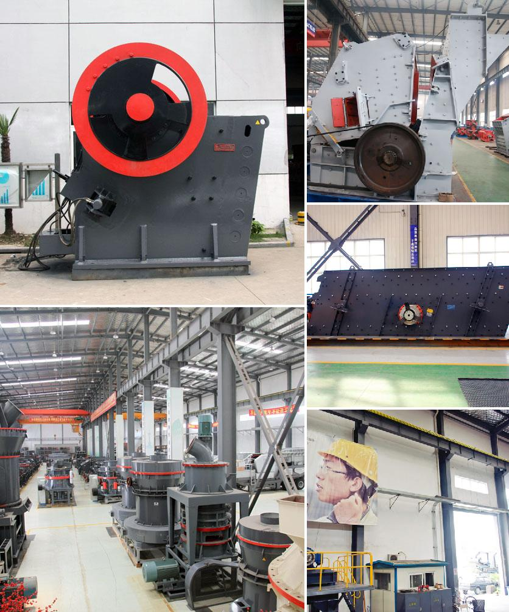

<h3>Why is there a need to crush iron ore bearing rock?</h3>
Iron ore is a crucial raw material for the production of iron and steel. Iron is essential in our daily lives, whether it be used for automobiles, construction materials, tools, or even kitchenware. To obtain usable iron, the iron ore must go through a series of processes, including crushing and grinding, to extract the minerals from the rock. This article aims to shed light on why there is a need to crush iron ore bearing rock.

One of the primary reasons to crush iron ore bearing rock is to facilitate the extraction process. An important step in extracting iron ore is crushing the ore into pieces that are small enough to enter the grinding mill. This is necessary to ensure that the grinding mill can efficiently separate the useful minerals from the waste rock and impurities.

Iron ore is typically found in large deposits, which are often a combination of valuable minerals and worthless rock. By crushing the ore, the valuable minerals can be separated from the rock, allowing for a higher concentration of iron to be obtained. Once the minerals are separated, they can be further processed and purified to produce iron for various applications.

Crushing the iron ore also aids in the uniformity of size, which is crucial for efficient grinding in the subsequent stages of processing. After the crushing process, the ore is typically ground to a fine powder in a series of grinding mills. The crushed ore particles need to have a consistent size distribution to ensure the grinding process is efficient. If the ore particles are too large, they will not be properly ground, leading to excessive energy consumption and decreased efficiency.

Additionally, crushing the iron ore bearing rock helps to expose more of the valuable minerals, increasing the surface area available for chemical reactions. This is particularly important when using various chemical processes to extract iron from the ore. By exposing a greater surface area to the leaching agents or smelting processes, the iron minerals can be more effectively and efficiently separated from the rock matrix.

Furthermore, crushing also allows for a more thorough inspection of the ore for impurities. During the crushing process, any potentially harmful impurities, such as sulfur or phosphorous, can be detected, analyzed, and monitored. This ensures that the final iron product meets quality standards and eliminates any negative impacts on downstream processing or the final application of the iron.

In conclusion, the need to crush iron ore bearing rock is essential in the extraction and processing of iron. By crushing the rock, valuable minerals can be separated from the worthless rock matrix, increasing the concentration of iron in the ore. This process also aids in maintaining a consistent size distribution for efficient grinding and exposes more surface area for chemical reactions. Crushing the ore enables thorough inspection for harmful impurities, ensuring high-quality iron product output.
<h3>Contact us</h3><ul><li><strong>Whatsapp:&nbsp;<a href="https://wa.me/8613661969651">+8613661969651</a></strong></li><li><a href="https://swt.shibang-china.com/?git&amp;zhl"><strong>Online Service(chat now)</strong></a></li></ul><h3>Related</h3><ul><li><a href='Why%20did%20iron%20ore%20beneficiation%20use%20the%20reverse%20flotation%20cell%3F.md'>Why did iron ore beneficiation use the reverse flotation cell?</a></li><li><a href='Why%20does%20the%20lubricating%20oil%20pressure%20increase%20in%20a%20cone%20crusher%3F.md'>Why does the lubricating oil pressure increase in a cone crusher?</a></li><li><a href='Why%20is%20a%20crusher%20section%20used%20in%20the%20cement%20industry%3F.md'>Why is a crusher section used in the cement industry?</a></li><li><a href='Why%20is%20coal%20crushed%20up%20in%20a%20coal%20powered%20station%3F.md'>Why is coal crushed up in a coal powered station?</a></li><li><a href='Why%20is%20ash%20removed%20in%20a%20coal%20preparation%20plant%3F.md'>Why is ash removed in a coal preparation plant?</a></li></ul>