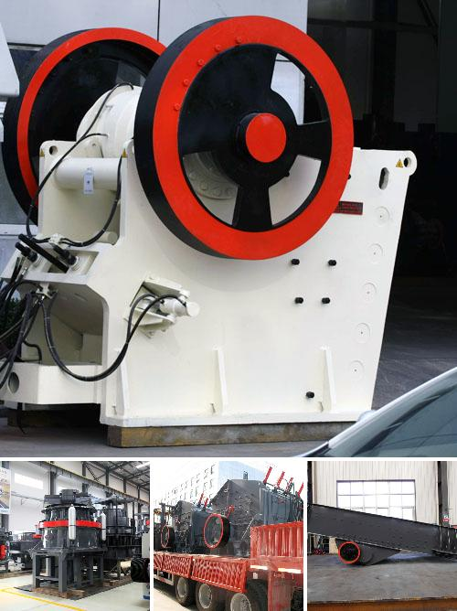

<h3>Why is there less dust in a vertical roller mill?</h3>
One of the most important aspects of industrial production is the health and safety of workers. With the constant advancements in technology, industries are constantly striving to create safer working environments for their employees. One area that has seen significant improvements in terms of dust control is the operation of vertical roller mills.

Vertical roller mills are a type of grinding equipment used in the cement industry for processing raw materials and cement clinker. They consist of a rotating table and grinding rollers that help to grind materials such as coal, cement, and other bulk minerals. The material is pulverized by the grinding rollers and is transported by air to the classifier.

Compared to traditional ball mills, vertical roller mills have several advantages, one of which is the significant reduction in dust levels. Dust is a hazardous substance that can cause respiratory issues, lung diseases, and other health problems. So, why is there less dust in a vertical roller mill?

Firstly, the design and operation of vertical roller mills promote better dust control. The material is fed through a central chute onto the table, and the grinding rollers crush it into fine particles. The particles are then transported by air to the classifier, which separates the ground material from larger particles. This closed system prevents dust from escaping into the surrounding environment, ensuring a cleaner and safer workplace.

Secondly, vertical roller mills have an integrated dust extraction system. As the material is ground and transported, exhaust air is generated containing fine particles and dust. This air is extracted using high-efficiency fans, and the dust is collected in a bag filter or electrostatic precipitator. These devices efficiently capture the dust particles, preventing their release into the atmosphere.

Furthermore, the grinding process in a vertical roller mill is highly efficient, reducing the need for extensive grinding and minimizing the creation of dust. The grinding rollers exert high pressure on the material, effectively reducing it to fine powder without excessive abrasion. This efficient grinding process reduces the generation of dust, maintaining a cleaner working environment.

Another factor contributing to the lower dust levels in vertical roller mills is the use of advanced materials and coatings. The grinding plates, rollers, and other components are often made from wear-resistant steel or coated with anti-abrasion materials. This further reduces the generation of dust, as well as the wear and tear of the mill's internal components.

In conclusion, the adoption of vertical roller mills in various industries, particularly in cement production, has resulted in a significant reduction in dust levels. The design and operation of these mills, along with integrated dust extraction systems, ensure a cleaner and safer workplace for operators. Additionally, the efficient grinding process and advanced materials used in vertical roller mills further contribute to the reduction in dust generation. As industries continue to prioritize worker safety, the use of vertical roller mills is likely to increase, leading to even better dust control in industrial settings.
<h3>Contact us</h3><ul><li><strong>Whatsapp:&nbsp;<a href="https://wa.me/8613661969651">+8613661969651</a></strong></li><li><a href="https://swt.shibang-china.com/?git&amp;zhl"><strong>Online Service(chat now)</strong></a></li></ul><h3>Related</h3><ul><li><a href='Why%20fine%20material%20should%20not%20enter%20a%20jaw%20crusher%3F.md'>Why fine material should not enter a jaw crusher?</a></li><li><a href='Why%20is%20coal%20crushed%20before%20being%20burned%3F.md'>Why is coal crushed before being burned?</a></li><li><a href='Why%20did%20iron%20ore%20beneficiation%20use%20the%20reverse%20flotation%20cell%3F.md'>Why did iron ore beneficiation use the reverse flotation cell?</a></li><li><a href='Why%20is%20the%20crusher%20used%20in%20the%20coal%20mining%20area%3F.md'>Why is the crusher used in the coal mining area?</a></li><li><a href='Why%20is%20manganese%20jaw%20used%20in%20a%20crusher%3F.md'>Why is manganese jaw used in a crusher?</a></li></ul>