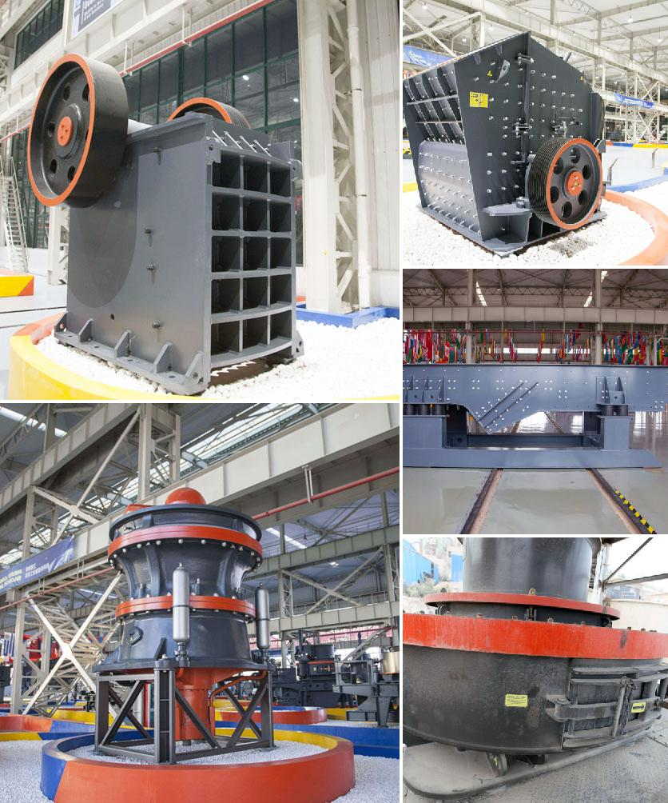

<h3>Why does a steel plant need a slag processing plant?</h3>
Steel production is an essential industry that plays a vital role in the global economy. With the increasing demand for steel, new steel plants are being established all around the world. One crucial aspect of steel production is the generation of by-products, including slag. Slag, a by-product formed during the smelting process, needs to be properly processed and managed. That is where a slag processing plant becomes necessary.

Slag is formed as a result of the impurities present in raw materials such as iron ore, limestone, and coke, being oxidized by the blowing of air through the molten iron. It is a complex mixture of various compounds, including silicates, aluminates, and calcium sulfide. The composition and characteristics of slag depend on various factors such as the raw materials used and the manufacturing process.

So, why does a steel plant need a slag processing plant? There are several compelling reasons for this, including environmental, economic, and sustainability factors.

Firstly, an important reason to have a slag processing plant is the environmental impact. Slag contains potentially hazardous elements such as heavy metals, which can pollute soil, water bodies, and air if not properly managed. By processing slag, harmful substances can be removed or reduced to permissible levels, ensuring the protection of the environment and human health.

Secondly, a slag processing plant is crucial for the economic benefits it brings. Slag, if properly processed, can be converted into valuable products with various applications. For example, it can be used as a raw material in cement production, as a substitute for natural aggregates in road construction, or as a filler material in the production of concrete and asphalt. By recovering and reusing slag, steel plants can save on disposal costs and generate additional revenue by selling these by-products.

Furthermore, the establishment of a slag processing plant is in line with the principles of sustainability. As resources become scarcer, it is essential to explore ways to optimize resource usage and minimize waste. Recycling and utilizing slag contribute to a circular economy, where materials are no longer treated as waste but as valuable resources. This reduces the dependence on virgin raw materials and mitigates the environmental impacts associated with their extraction and processing.

In summary, a steel plant requires a slag processing plant for several reasons. Firstly, it ensures environmental protection by removing or reducing hazardous substances present in slag. Secondly, a slag processing plant allows for the recovery and reuse of valuable materials, generating economic benefits and reducing disposal costs. Finally, it aligns with the principles of sustainability and a circular economy, promoting responsible resource management.

Overall, the establishment of a slag processing plant is not only beneficial to steel plants but also to the environment, the economy, and the pursuit of a more sustainable future.
<h3>Contact us</h3><ul><li><strong>Whatsapp:&nbsp;<a href="https://wa.me/8613661969651">+8613661969651</a></strong></li><li><a href="https://swt.shibang-china.com/?git&amp;zhl&amp;Why-does-a-steel-plant-need-a-slag-processing-plant"><strong>Online Service(chat now)</strong></a></li></ul><h3>Related</h3><ul><li><a href='Why-is-basalt-used-as-an-aggregate-for-road-construction.md'>Why is basalt used as an aggregate for road construction?</a></li><li><a href='Why-is-track-mounted-crushing-plant-at-the-pit-rather-than-fixed-plant.md'>Why is track mounted crushing plant at the pit rather than fixed plant?</a></li><li><a href='Why-is-ash-removed-in-a-coal-preparation-plant.md'>Why is ash removed in a coal preparation plant?</a></li><li><a href='Why-is-there-screening-after-crushing.md'>Why is there screening after crushing?</a></li><li><a href='Why-is-artificial-sand-used.md'>Why is artificial sand used?</a></li></ul>