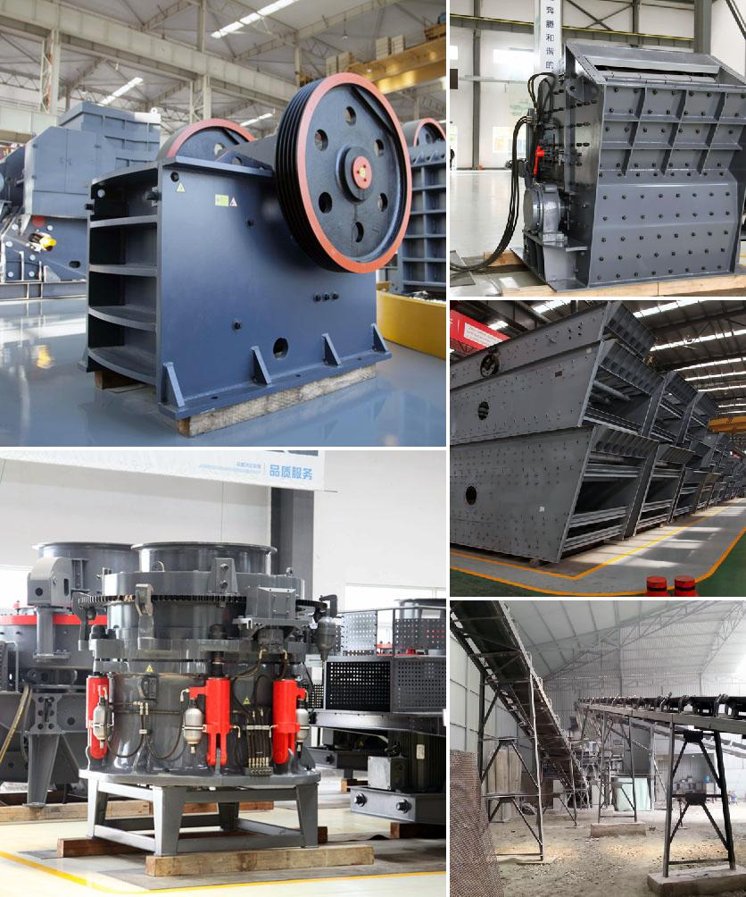

<h3>Why does the lubricating oil pressure increase in a cone crusher?</h3>
Cone crushers are widely used in various industries, such as mining, metallurgy, building materials, and chemical engineering. With the continuous development of these industries, cone crushers have become more and more advanced in terms of performance and efficiency. However, one issue that operators often encounter is the increase in lubricating oil pressure within the cone crusher. In this article, we will explore the reasons behind this phenomenon.

Firstly, it is important to understand the basic principles of cone crushers. These machines use compression to break down materials, with the help of a rotating mantle and a concave stationary bowl liner. During operation, the mantle moves eccentrically in relation to the concave, causing the material to be crushed. To ensure proper functioning, cone crushers require adequate lubrication to reduce friction and prevent parts from wearing out.

One of the main reasons behind the increase in lubricating oil pressure within a cone crusher is the accumulation of dust in the system. Dust, dirt, and debris can cause the oil to become contaminated, leading to blockages and ultimately resulting in increased pressure. This is particularly common in environments where there is high dust exposure, such as mining sites.

Moreover, the wear of parts within the cone crusher can also contribute to the increase in oil pressure. When components such as the mantle and bowl liner wear down, the gap between them widens. This results in an increased oil volume required to fill this larger gap, leading to a higher pressure within the lubrication system. Regular maintenance and replacement of worn parts can help prevent this issue.

Another potential cause of increased oil pressure is a malfunctioning or clogged oil pump. The oil pump serves the crucial function of circulating and pressurizing the lubrication oil throughout the crusher. If the pump is not functioning properly or if it becomes clogged with debris, it can disrupt the normal oil flow, leading to a pressure increase. In such cases, the oil pump should be inspected and repaired as necessary.

Furthermore, the type and viscosity of the lubricating oil can also affect the pressure within the cone crusher. Different manufacturers recommend specific types of oil for their machines, and using the wrong type or viscosity can lead to issues, including increased pressure. It is essential to follow the manufacturer's guidelines and ensure that the correct oil is being used.

In conclusion, there are several factors that can cause the lubricating oil pressure to increase in a cone crusher. These include the accumulation of dust, wear and tear of parts, malfunctioning oil pumps, and the use of incorrect oil types. Regular maintenance, proper lubrication, and adherence to manufacturer guidelines can help mitigate these issues and ensure the optimal functioning of cone crushers. By understanding these causes and taking necessary precautions, operators can effectively manage oil pressure and prolong the lifespan of their cone crushers.
<h3>Contact us</h3><ul><li><strong>Whatsapp:&nbsp;<a href="https://wa.me/8613661969651">+8613661969651</a></strong></li><li><a href="https://swt.shibang-china.com/?git&amp;zhl&amp;Why-does-the-lubricating-oil-pressure-increase-in-a-cone-crusher"><strong>Online Service(chat now)</strong></a></li></ul><h3>Related</h3><ul><li><a href='Why-does-a-ball-mill-start-slowly.md'>Why does a ball mill start slowly?</a></li><li><a href='Why-does-the-hopper-need-to-be-cleaned-in-the-crusher-plant.md'>Why does the hopper need to be cleaned in the crusher plant?</a></li><li><a href='Why-should-we-use-aggregate-washing-systems.md'>Why should we use aggregate washing systems?</a></li><li><a href='Why-use-a-double-drive-in-a-ball-mill.md'>Why use a double-drive in a ball mill?</a></li><li><a href='Why-is-ball-milling-a-nonequilibrium-process.md'>Why is ball milling a nonequilibrium process?</a></li></ul>