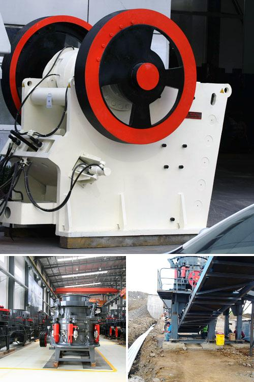

<h3>Why does the temperature of the mill grinding roller become high?</h3>
The grinding roller is an essential component of a mill as it is responsible for crushing the material into fine powder. However, in some cases, the temperature of the mill grinding roller tends to rise, which can lead to various problems. Understanding the reasons behind this issue is crucial for maintaining the optimal performance of the mill and avoiding potential damage.

One of the primary reasons for the high temperature of the mill grinding roller is excessive friction. As the roller rotates, it comes into direct contact with the material being crushed. Friction occurs when two surfaces rub against each other, generating heat in the process. If the friction between the grinding roller and the material is excessive, it can cause the temperature to rise significantly.

Another factor contributing to the high temperature of the mill grinding roller is inadequate lubrication. Proper lubrication is essential for reducing friction and heat generation. If there is insufficient lubrication or the lubricant used is of poor quality, it can lead to increased friction and, consequently, higher temperatures.

Apart from friction and lubrication issues, another reason for the high temperature is the accumulation of material on the grinding roller surface. During the grinding process, fine particles of the material tend to adhere to the roller, forming a thick layer over time. This accumulation prevents efficient heat dissipation, resulting in the rise of temperature.

Furthermore, the design and quality of the grinding roller can also play a significant role in the temperature increase. A poorly designed or low-quality roller may have inadequate heat dissipation capabilities, causing it to heat up quickly during operation.

The high temperature of the mill grinding roller can have several adverse effects. Firstly, it can lead to thermal expansion of the roller, affecting the precision of the grinding process. This thermal expansion can also result in the loosening of critical components, leading to increased vibrations and inefficient operation.

Moreover, the excessive heat can cause thermal deformation of the grinding roller, altering its shape and affecting the overall grinding performance. This deformation can lead to uneven crushing and reduced product quality.

To address the issue of high temperature in mill grinding rollers, several measures can be taken. Firstly, ensuring proper lubrication by using high-quality lubricants and maintaining regular lubrication schedules will help reduce friction and heat generation. Regular cleaning of the grinding rollers to remove accumulated material is also crucial.

Improving the design and quality of the grinding roller, including enhancing heat dissipation capabilities, can also mitigate the temperature rise. Additionally, monitoring the temperature during operation and implementing appropriate cooling methods, such as air or water cooling, can help regulate the temperature within desired limits.

In conclusion, the high temperature of the mill grinding roller can be attributed to factors such as excessive friction, inadequate lubrication, accumulation of material, and poor design. Understanding and addressing these issues are vital for maintaining the optimal performance of the mill, preventing damage, and ensuring the production of high-quality crushed material.
<h3>Contact us</h3><ul><li><strong>Whatsapp:&nbsp;<a href="https://wa.me/8613661969651">+8613661969651</a></strong></li><li><a href="https://swt.shibang-china.com/?git&amp;zhl&amp;Why-does-the-temperature-of-the-mill-grinding-roller-become-high"><strong>Online Service(chat now)</strong></a></li></ul><h3>Related</h3><ul><li><a href='Why-is-ball-milling-a-nonequilibrium-process.md'>Why is ball milling a nonequilibrium process?</a></li><li><a href='Why-should-we-use-aggregate-washing-systems.md'>Why should we use aggregate washing systems?</a></li><li><a href='Why-is-coal-crushed-up-in-a-coal-powered-station.md'>Why is coal crushed up in a coal powered station?</a></li><li><a href='Why-is-a-crusher-section-used-in-the-cement-industry.md'>Why is a crusher section used in the cement industry?</a></li><li><a href='How-is-a-jaw-crusher-feed-and-why.md'>How is a jaw crusher feed, and why?</a></li></ul>