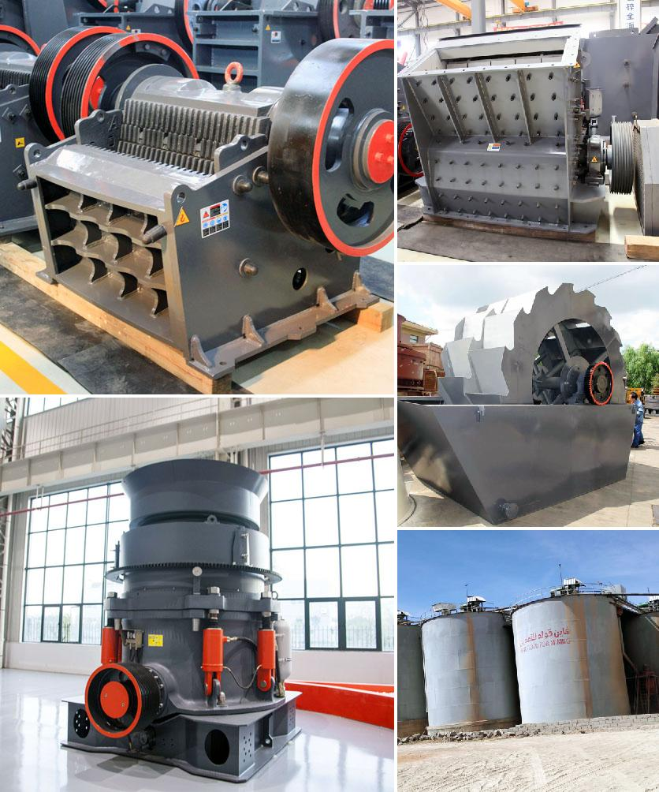

<h3>Why is a ball mill used for grinding silica sand?</h3>
Silica sand is a major component in many different industries, including glass manufacturing, construction, and oil and gas extraction. It is widely used in the manufacture of various products such as glass containers, fiberglass insulation, and ceramics. Silica sand needs to be processed into different sizes to meet the demands of these industries, and a ball mill is typically used.

A ball mill is a cylindrical drum rotating around its horizontal axis, partially filled with grinding media such as ceramic balls, flint pebbles, or stainless steel balls. The material to be ground is added to the partially filled drum along with the grinding media and subjected to vibrations, rotations, or both to achieve the desired particle size reduction.

One significant advantage of using a ball mill for grinding silica sand is its high capacity. This capability allows manufacturers to process high volumes of silica sand efficiently. Due to the high energy input required, the initial cost of a ball mill may be quite high. However, its long-term operational benefits, such as increased productivity and reduced maintenance costs, make it a worthwhile investment.

The size reduction process in a ball mill occurs through impact and attrition. The grinding media employed in the mill are responsible for crushing and grinding the silica sand particles into fine powders. This process ensures the consistent and uniform reduction of particle size while simultaneously preventing the accumulation of coarse particles.

Another advantage of using a ball mill for grinding silica sand is the low wear of the mill's interior components. This is achieved by using ceramic materials for both the grinding media and the mill lining. Such materials are highly wear-resistant and can withstand the harsh grinding conditions encountered in a ball mill.

The use of ball mills for grinding silica sand also helps to automate and optimize production processes. As the grinding media interact with the material being ground, they generate heat, which can affect the integrity of the final product. To prevent overheating, cooling systems are often incorporated into the milling process.

In addition to these benefits, a ball mill can achieve a finer grind compared to other grinding options, such as vertical roller mills or stirred media mills. This is crucial in the production of high-quality silica sand products, where a narrow particle size distribution is required.

In conclusion, a ball mill is an essential tool for grinding silica sand due to its high capacity, low wear, and ability to achieve a fine grind. It is widely used across various industries where silica sand is a key component. Manufacturers can rely on ball mills to process silica sand efficiently and cost-effectively, ensuring the production of high-quality and consistent products.
<h3>Contact us</h3><ul><li><strong>Whatsapp:&nbsp;<a href="https://wa.me/8613661969651">+8613661969651</a></strong></li><li><a href="https://swt.shibang-china.com/?git&amp;zhl&amp;Why-is-a-ball-mill-used-for-grinding-silica-sand"><strong>Online Service(chat now)</strong></a></li></ul><h3>Related</h3><ul><li><a href='Why-is-there-less-dust-in-a-vertical-roller-mill.md'>Why is there less dust in a vertical roller mill?</a></li><li><a href='Why-is-basalt-used-as-an-aggregate-for-road-construction.md'>Why is basalt used as an aggregate for road construction?</a></li><li><a href='Why-is-a-cyclone-required-in-a-cement-ball-mill.md'>Why is a cyclone required in a cement ball mill?</a></li><li><a href='Why-is-track-mounted-crushing-plant-at-the-pit-rather-than-fixed-plant.md'>Why is track mounted crushing plant at the pit rather than fixed plant?</a></li><li><a href='Why-is-an-impact-crusher-used-to-run-limestone.md'>Why is an impact crusher used to run limestone?</a></li></ul>