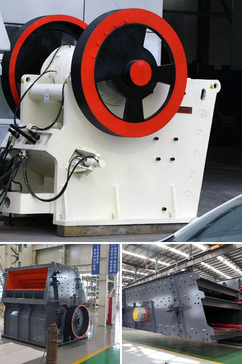

<h3>Why is a crusher section used in the cement industry?</h3>
In the cement production process, there are several stages that proved to be crucial for producing high-quality cement. One important stage is the crusher section in the cement industry. In this section, the raw materials are crushed to form a powder-like substance called clinker.

The crusher section is well-known for its ability to reduce the size of larger rocks and turn them into gravel-like materials. This is an essential component in the cement-making process. Without a properly functioning crusher section, the entire operation would cease to exist and the end product, cement, would not be produced.

One of the main reasons why the crusher section is used in the cement industry is to reduce the size of large rocks and raw materials to a manageable size. These rocks and materials cannot be used directly in the cement-making process and need to be broken down into smaller pieces. This reduction in size is crucial as it allows for easier handling, transportation, and processing of these materials.

Furthermore, the crusher section also aids in ensuring the quality of the final cement product. By reducing the size of the raw materials, it increases the surface area available for the chemical reactions that occur during the production of cement. This enhanced surface area allows for better mixing of the raw materials, resulting in more homogeneous and high-quality cement.

Moreover, the crusher section helps to control the particle size distribution of the crushed materials. This is important as it directly impacts the properties of the cement. By controlling the particle size distribution, the cement produced can have specific characteristics, such as strength, setting time, and durability. These properties are crucial for the final application of the cement.

Additionally, the use of a crusher section in the cement industry is also beneficial from an economic standpoint. By crushing the raw materials, the cement production process becomes more efficient. This efficiency results in cost savings as less energy is required to crush smaller particles. It also reduces waste and optimizes the use of raw materials.

Furthermore, the crusher section is equipped with various safety measures to ensure the well-being of the workers involved in the cement production process. These safety measures include safety guards, emergency stop buttons, and proper training for the workers operating the crusher section. The implementation of these safety measures minimizes the risks of accidents and injuries, making the workplace safer for everyone.

In conclusion, the crusher section plays a crucial role in the cement industry. It reduces the size of raw materials, enhancing their surface area for better chemical reactions, improving the quality of the final cement product, and ensuring efficient and safe cement production. Without a properly functioning crusher section, the production of high-quality cement would not be possible. Therefore, it is evident that the crusher section is an integral part of the cement production process.
<h3>Contact us</h3><ul><li><strong>Whatsapp:&nbsp;<a href="https://wa.me/8613661969651">+8613661969651</a></strong></li><li><a href="https://swt.shibang-china.com/?git&amp;zhl&amp;Why-is-a-crusher-section-used-in-the-cement-industry"><strong>Online Service(chat now)</strong></a></li></ul><h3>Related</h3><ul><li><a href='Why-are-carbon-forged-balls-used-in-ball-mills.md'>Why are carbon-forged balls used in ball mills?</a></li><li><a href='Why-did-iron-ore-beneficiation-use-the-reverse-flotation-cell.md'>Why did iron ore beneficiation use the reverse flotation cell?</a></li><li><a href='Why-is-coal-crushed-in-power-plants.md'>Why is coal crushed in power plants?</a></li><li><a href='Why-are-classifiers-used-in-ball-mills.md'>Why are classifiers used in ball mills?</a></li><li><a href='Why-is-there-screening-after-crushing.md'>Why is there screening after crushing?</a></li></ul>