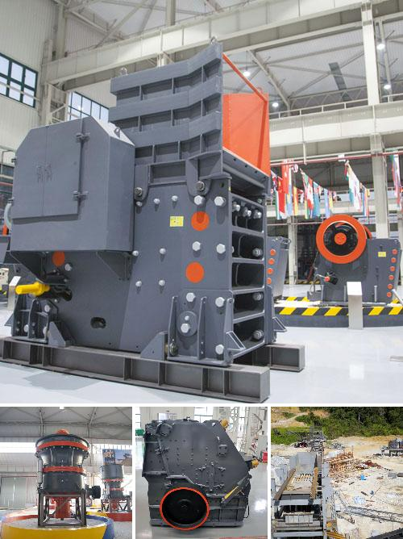

<h3>Why is coal crushed before being burned?</h3>
Coal has been used as a major source of energy for centuries, providing heat and electricity to power industries and personal electronics. Before it can be utilized efficiently, however, coal must undergo certain processes, including crushing. This raises an important question: why is coal crushed before being burned?

The primary reason for crushing coal is to ensure that it can be combusted easily and efficiently. Coal combustion process requires the reduced size of coal particles for complete combustion. Crushing coal reduces its moisture content and makes it more efficient for burning. When coal is crushed, the overall surface area of the coal particles increases, improving the coal's combustion ability.

Coal is a heterogeneous fuel, comprising different types of carbon compounds, varying amounts of moisture, and impurities such as sulfur and ash. These impurities lower the heat value and efficiency of the coal. Crushing coal helps to remove foreign materials and gangue, ensuring that the coal can be used effectively and efficiently.

Moreover, crushing coal enhances its reactivity. Coal is made up of organic matter that has undergone partial decay in the Earth's crust over millions of years. The crushing process breaks down the coal's molecular structure, releasing volatile components that can be combusted to generate heat. By increasing the surface area and reducing the size of coal particles, crushing allows for more efficient heat generation during combustion.

Crushed coal also facilitates better combustion control. When coal particles are smaller, they burn more quickly and evenly. This leads to improved combustion efficiency, reduced emissions, and enhanced heat transfer. The smaller coal particles readily mix with oxygen, creating a greater surface area for combustion reactions to take place, resulting in a more efficient and complete burn.

Another significant reason for crushing coal is its impact on transportation and storage. Coal is often transported by trains or trucks and stored in stockpiles or silos. By crushing coal into smaller pieces, its density increases. This allows for the transportation and storage of greater quantities of coal within the same space or volume. Furthermore, crushed coal is typically easier to handle and load onto conveyors, ensuring a smoother transportation process.

In conclusion, crushing coal before it is burned is crucial for several reasons. Firstly, it increases the surface area, enhancing the coal's combustion ability and reactivity. Secondly, crushing removes impurities, improving the coal's heat value and efficiency. Lastly, crushed coal enables better combustion control, leading to reduced emissions and enhanced heat transfer. Additionally, crushing coal optimizes transportation and storage by increasing its density and ease of handling. Considering these factors, it is evident why coal is crushed before being burned, as it is an essential step towards efficient and effective utilization of this valuable natural resource.
<h3>Contact us</h3><ul><li><strong>Whatsapp:&nbsp;<a href="https://wa.me/8613661969651">+8613661969651</a></strong></li><li><a href="https://swt.shibang-china.com/?git&amp;zhl&amp;Why-is-coal-crushed-before-being-burned"><strong>Online Service(chat now)</strong></a></li></ul><h3>Related</h3><ul><li><a href='Why-is-coal-crushed-up-in-a-coal-powered-station.md'>Why is coal crushed up in a coal powered station?</a></li><li><a href='Why-must-cerussitelead-carbonate-be-crushed.md'>Why must cerussite(lead carbonate) be crushed?</a></li><li><a href='Why-is-the-crusher-used-in-the-coal-mining-area.md'>Why is the crusher used in the coal mining area?</a></li><li><a href='Why-is-vertical-roller-mill-based-dry-grinding-not-used-in-iron-ore-processing.md'>Why is vertical roller mill-based dry grinding not used in iron ore processing?</a></li><li><a href='Why-are-classifiers-used-in-ball-mills.md'>Why are classifiers used in ball mills?</a></li></ul>