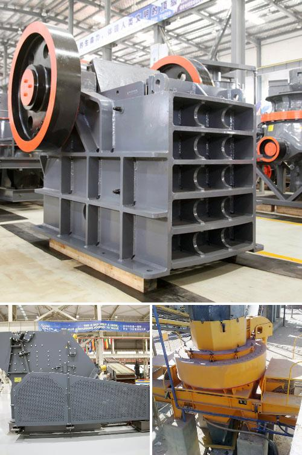

<h3>Why is coal crushed up in a coal powered station?</h3>
Coal has been a crucial source of energy for centuries. It is primarily used for electricity generation in coal-fired power plants. However, before it can be used as fuel, coal must undergo various processes, including crushing. This article will explore the reasons behind crushing coal in a coal-powered station.

Coal, as it is extracted from mines, consists of large rock-like chunks. Before it can be efficiently burned, it needs to be crushed into smaller pieces. There are several key purposes for crushing coal in a coal-powered station:

1. Improved Combustion Efficiency: The main aim of crushing coal is to provide a larger surface area for combustion. By breaking it into smaller particles, the surface area is significantly increased. This increased surface area allows for better contact between the coal and the oxygen in the air. As a result, the combustion process becomes more efficient, leading to better energy conversion and higher electricity generation.

2. Uniformity: The quality and consistency of coal size are important factors for steady and reliable combustion. If coal is not evenly crushed, it can lead to irregular and incomplete combustion, resulting in lower overall power output and increased emissions. By crushing coal to a consistent size, the coal-powered station ensures a more uniform combustion process, minimizing variations in heat release and enhancing overall efficiency.

3. Improved Handling: Crushed coal is easier to handle and transport compared to large chunks. After crushing, coal is typically stored in stockpiles before being loaded onto trains or trucks for transport to power plants. The smaller size allows for efficient loading and unloading operations, reducing human effort and time while increasing productivity.

4. Suitable Size for Burning Equipment: Coal power plants consist of various types of burning equipment, such as boilers and furnaces, designed to efficiently convert coal into heat. These equipment have specific requirements in terms of the maximum coal particle size they can handle. By crushing coal to a suitable size, it ensures compatibility with the plant's combustion system, preventing potential equipment failures and optimizing performance.

5. Reduction of Moisture Content: Crushing coal also aids in reducing its moisture content. Wet or damp coal is challenging to ignite, thus requiring more energy during the combustion process. By crushing coal and reducing its moisture content, a coal-powered station improves the overall combustion process, reduces energy consumption, and minimizes the formation of pollutants.

In conclusion, crushing coal in a coal-powered station serves various critical purposes. It increases the combustion efficiency, provides uniformity in coal size, improves handling and transport, meets equipment requirements, and reduces the moisture content. These factors ultimately contribute to the overall reliability, efficiency, and environmental friendliness of coal-fired power generation. However, it is important to acknowledge the environmental concerns associated with coal power and the ongoing shift towards cleaner energy sources.
<h3>Contact us</h3><ul><li><strong>Whatsapp:&nbsp;<a href="https://wa.me/8613661969651">+8613661969651</a></strong></li><li><a href="https://swt.shibang-china.com/?git&amp;zhl&amp;Why-is-coal-crushed-up-in-a-coal-powered-station"><strong>Online Service(chat now)</strong></a></li></ul><h3>Related</h3><ul><li><a href='Why-use-a-double-drive-in-a-ball-mill.md'>Why use a double-drive in a ball mill?</a></li><li><a href='Why-is-the-crusher-used-in-the-coal-mining-area.md'>Why is the crusher used in the coal mining area?</a></li><li><a href='Why-is-vertical-roller-mill-based-dry-grinding-not-used-in-iron-ore-processing.md'>Why is vertical roller mill-based dry grinding not used in iron ore processing?</a></li><li><a href='Why-should-we-use-aggregate-washing-systems.md'>Why should we use aggregate washing systems?</a></li><li><a href='Why-is-track-mounted-crushing-plant-at-the-pit-rather-than-fixed-plant.md'>Why is track mounted crushing plant at the pit rather than fixed plant?</a></li></ul>