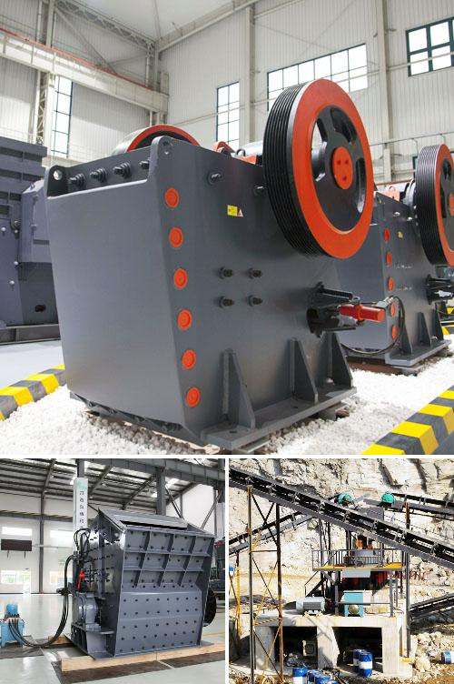

<h3>Why is manganese jaw used in a crusher?</h3>
Crushers are heavy-duty machines designed to crush large debris into smaller, more manageable fragments. These machines are typically used in various industries such as mining, cement, construction, and recycling to reduce the size of raw materials and facilitate easier processing. One critical component of a crusher is its jaw, also known as a fixed or swing jaw. It plays a crucial role in the crushing process. While there are various materials used in an crusher's jaw, manganese steel is commonly utilized due to its exceptional qualities.

Manganese steel, also known as Hadfield steel, is a type of steel alloy containing an average of around 13% manganese. It is known for its high impact strength and resistance to abrasion once in its work-hardened state. It is an essential material for industrial applications that require heavy-duty durability, such as in the construction of crushers.

One of the primary reasons why manganese steel is used in crusher jaws is its capability to withstand extreme impact and abrasive forces. These forces can cause significant wear and tear on the jaw plates, resulting in frequent replacements and increased downtime. Manganese steel, however, exhibits a unique self-hardening feature. When subjected to impact or pressure, it forms a hardened layer on the surface, which increases its surface hardness and wear resistance. This work-hardening ability ensures that the jaw plates maintain their integrity and remain durable for an extended period, reducing the need for frequent replacements.

Furthermore, manganese steel's high impact strength makes it an ideal material for crushers handling tough and abrasive materials. As materials are crushed between the jaws, intense forces are generated. If the jaw material is not strong enough, it may fail under the excessive pressure, leading to costly damage and downtime. By using manganese steel, which has excellent impact resistance, crushers can effectively process tough materials without suffering from premature failure.

Another advantage of using manganese steel jaws in crushers is their ability to withstand high compressive forces. As the jaws come together, exerting pressure on the material being crushed, a strong material is required to withstand these forces without deforming or fracturing. Manganese steel's high tensile strength ensures that it can handle the compressive forces exerted during the crushing process, allowing for efficient and reliable operation.

In addition to its mechanical properties, manganese steel is also highly weldable. This enables repair and refurbishment of worn jaw plates, ultimately extending the lifespan of crushers. Welding can be done on manganese steel without cracking or weakening its overall structure, making it a cost-effective solution for maintenance and repairs.

In conclusion, the use of manganese jaws in crushers is well-founded due to the material's exceptional properties. Manganese steel provides high impact strength, resistance to abrasion, and the ability to withstand extreme forces without premature failure. Its work-hardening feature further enhances the jaw's durability, ensuring extended lifespan and reduced downtime. By utilizing manganese steel, crushers can process tough, abrasive materials efficiently and reliably while minimizing maintenance costs.
<h3>Contact us</h3><ul><li><strong>Whatsapp:&nbsp;<a href="https://wa.me/8613661969651">+8613661969651</a></strong></li><li><a href="https://swt.shibang-china.com/?git&amp;zhl&amp;Why-is-manganese-jaw-used-in-a-crusher"><strong>Online Service(chat now)</strong></a></li></ul><h3>Related</h3><ul><li><a href='Why-is-artificial-sand-used.md'>Why is artificial sand used?</a></li><li><a href='Why-is-coal-crushed-in-power-plants.md'>Why is coal crushed in power plants?</a></li><li><a href='Why-is-a-crusher-section-used-in-the-cement-industry.md'>Why is a crusher section used in the cement industry?</a></li><li><a href='Why-use-trunnion-bearings-in-cement-mills.md'>Why use trunnion bearings in cement mills?</a></li><li><a href='Why-is-manganese-ore-crushed.md'>Why is manganese ore crushed?</a></li></ul>