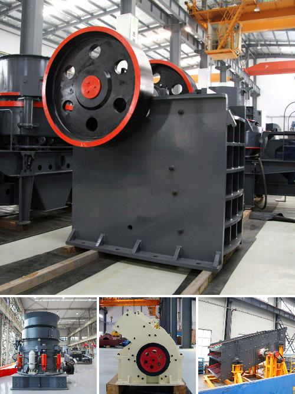

<h3>Why is the cone crusher known as a gyratory crusher?</h3>
The cone crusher, also known as the gyratory crusher, is a commonly used crushing machine for industries such as mining, metallurgy, building materials, and road construction. Its unique design allows for efficient crushing performance while minimizing energy consumption.

One of the main characteristics of the cone crusher is the gyratory motion of the mantle. This motion ensures that the material is evenly crushed, as it is continuously fed into the crushing chamber. The gyratory motion of the mantle is achieved through an eccentric bearing and a rotating shaft, which causes the mantle to periodically move back and forth.

The term "gyratory" refers to the rotational movement of the mantle around the central axis of the crusher. This motion results in a cone-shaped crushing chamber, where the materials are progressively crushed until they reach the desired size. The angle between the mantle and the concave, known as the crushing chamber angle, determines the size and shape of the final product.

One of the advantages of the cone crusher over other crushing machines is its high production efficiency. The gyratory motion of the mantle allows for a larger throughput capacity compared to other crushers. This means that more materials can be processed in a shorter amount of time, increasing overall productivity.

In addition to its efficient crushing performance, the cone crusher is also known for its versatility. It can be used for a wide range of applications, including secondary and tertiary crushing. This makes it suitable for various industries, from mining operations to construction projects.

Another reason why the cone crusher is known as a gyratory crusher is its ability to operate at high crushing speeds. Due to its steep crushing chamber angle and mantle eccentricity, the cone crusher can generate high crushing forces, resulting in superior crushing performance. This is especially beneficial when dealing with hard and abrasive materials.

Furthermore, the cone crusher is known for its reliability and durability. The robust design, coupled with high-quality components, ensures that the crusher can withstand heavy-duty applications and harsh operating conditions. Maintenance and servicing are also relatively straightforward, adding to its overall reliability.

In conclusion, the cone crusher is known as a gyratory crusher due to its gyratory motion and cone-shaped crushing chamber. Its efficient crushing performance, versatility, and ability to operate at high crushing speeds make it a preferred choice for various industries. With its reliability and durability, the cone crusher continues to be an essential crushing machine for many applications.
<h3>Contact us</h3><ul><li><strong>Whatsapp:&nbsp;<a href="https://wa.me/8613661969651">+8613661969651</a></strong></li><li><a href="https://swt.shibang-china.com/?git&amp;zhl&amp;Why-is-the-cone-crusher-known-as-a-gyratory-crusher"><strong>Online Service(chat now)</strong></a></li></ul><h3>Related</h3><ul><li><a href='Why-must-cerussitelead-carbonate-be-crushed.md'>Why must cerussite(lead carbonate) be crushed?</a></li><li><a href='Why-is-the-Quarry-Act-important.md'>Why is the Quarry Act important?</a></li><li><a href='Why-is-it-difficult-to-start-a-ball-mill.md'>Why is it difficult to start a ball mill?</a></li><li><a href='Why-is-there-screening-after-crushing.md'>Why is there screening after crushing?</a></li><li><a href='Why-is-artificial-sand-used.md'>Why is artificial sand used?</a></li></ul>