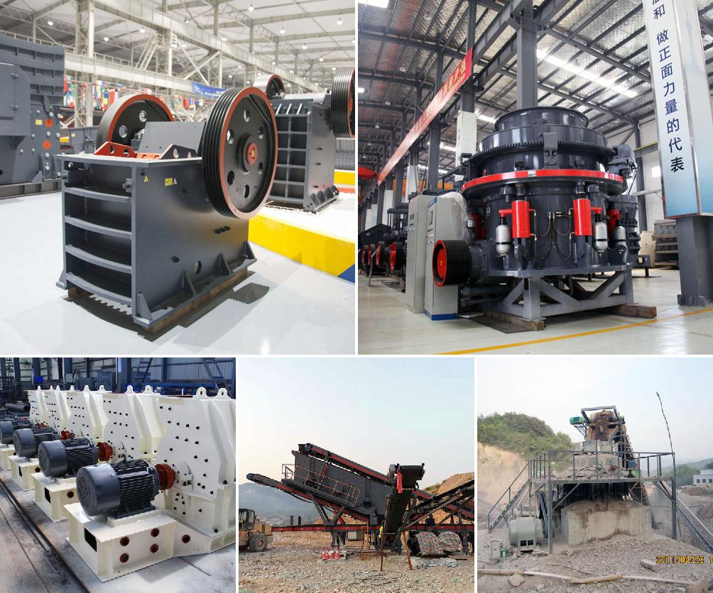

<h3>Why is the crusher used in the coal mining area?</h3>
In the coal mining industry, the crushing equipment plays a vital role in the processing of coal ores. It is the main equipment used to crush raw coal, and its crushing ratio directly affects the productivity and efficiency of the coal preparation plant. However, with the development of technology and the increase in market demand, various types of crushers have emerged, making it essential to choose the right equipment for the coal mining area.

Firstly, the crusher is used to break raw coal into smaller sizes, reducing the amount of unwanted materials in the coal. Coal needs to be efficiently processed to remove impurities such as rock, shale, and other detritus. Consequently, the crusher's main function is to reduce these raw coal materials into manageable sizes, often into smaller pieces suitable for transportation and subsequent processing. By crushing the coal, it also promotes the liberation of coal particles from the impurities, enhancing the efficiency of the coal cleaning process.

Secondly, crushers are used to ensure the appropriate particle size for coal combustion in power plants. Coal-fired power plants require pulverized coal with specific particle sizes to provide optimal combustion efficiency. The crusher helps achieve the desired coal particle size necessary for efficient and complete combustion. If the coal is not adequately crushed, it may result in poor combustion, lower power generation, increased emissions, and decreased overall efficiency. Therefore, crushers are essential in providing the desired particle size distribution of coal for combustion purposes.

Additionally, crushers are employed to facilitate efficient coal transportation. Mined coal usually contains oversized rocks and other debris that must be broken down before transportation. By reducing the coal into smaller sizes, the crusher allows for easier handling during loading and unloading operations, ultimately minimizing the risk of accidents and enhancing overall transportation efficiency.

Furthermore, the crusher also aids in coal sample preparation for testing and analysis. Accurate and representative coal samples are vital for determining the quality and composition of coal. Proper coal sampling helps in assessing coal properties, such as calorific value, sulfur content, moisture content, and ash content. Crushers are used to prepare coal samples in the required size range for laboratory analysis, ensuring accurate evaluation of coal quality.

To conclude, crushers are widely used in the coal mining area for several reasons. They break raw coal into smaller sizes, reducing unwanted materials and enhancing the efficiency of subsequent coal processing and cleaning operations. Crushers also facilitate appropriate coal particle sizes for combustion in power plants, improving overall combustion efficiency, power generation, and reducing emissions. Moreover, crushers aid in coal transportation by reducing the coal to manageable sizes. Lastly, crushers play a crucial role in coal sample preparation, ensuring accurate and representative samples for quality analysis. With the continued advancement of technology, crushers will continue to play a significant role in the coal mining industry, contributing to efficient and sustainable coal processing.
<h3>Contact us</h3><ul><li><strong>Whatsapp:&nbsp;<a href="https://wa.me/8613661969651">+8613661969651</a></strong></li><li><a href="https://swt.shibang-china.com/?git&amp;zhl&amp;Why-is-the-crusher-used-in-the-coal-mining-area"><strong>Online Service(chat now)</strong></a></li></ul><h3>Related</h3><ul><li><a href='Why-does-the-temperature-of-the-mill-grinding-roller-become-high.md'>Why does the temperature of the mill grinding roller become high?</a></li><li><a href='Why-is-basalt-used-as-an-aggregate-for-road-construction.md'>Why is basalt used as an aggregate for road construction?</a></li><li><a href='Why-must-cerussitelead-carbonate-be-crushed.md'>Why must cerussite(lead carbonate) be crushed?</a></li><li><a href='Why-does-a-steel-plant-need-a-slag-processing-plant.md'>Why does a steel plant need a slag processing plant?</a></li><li><a href='Why-are-classifiers-used-in-ball-mills.md'>Why are classifiers used in ball mills?</a></li></ul>