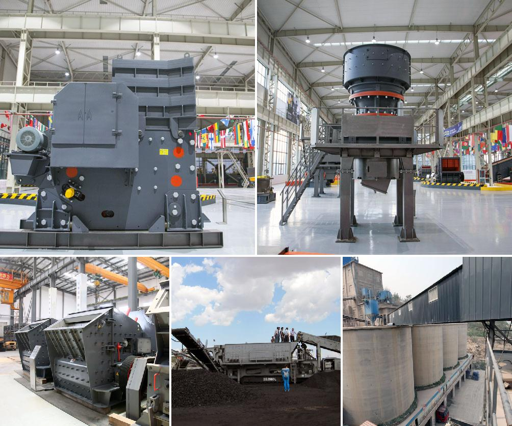

<h3>Why is track mounted crushing plant at the pit rather than fixed plant?</h3>
In the world of mining and quarrying, there is a constant need to process large amounts of materials. This task is often accomplished through the use of crushing plants. However, there are two main types of crushing plants to consider: fixed plant and track-mounted plant. Although each has its own merits, the track-mounted crushing plant is often preferred at the pit for several reasons.

The primary advantage of a track-mounted crushing plant is its ability to be mobile and therefore, easily transported to different locations in the pit or quarry. With its tracks, the plant can be maneuvered to wherever it's needed, providing flexibility and saving valuable time and resources. This is particularly advantageous in larger pits or quarries where the material needs to be processed at multiple locations.

Another benefit of a track-mounted crushing plant is its adaptability to various terrain and weather conditions. The tracks allow the plant to traverse uneven or rough ground, ensuring that it can reach even the most remote areas of the pit. This is particularly useful in rugged terrains or inclement weather, where a fixed plant would be restricted in its movements.

Furthermore, a track-mounted crushing plant offers greater accessibility to the material being processed. It can be positioned closer to the blasted rock or excavated material, reducing the need for long haul distances by trucks or conveyors. This not only saves time but also minimizes the risk of accidents or damage during the transportation process.

In addition to these practical advantages, the track-mounted crushing plant also offers cost-saving benefits. Firstly, it eliminates the need for expensive foundation work required for a fixed plant. The plant can be set up on-site, reducing the overall cost and time associated with installation.

Furthermore, the track-mounted crushing plant can be easily relocated or sold if the need arises. This flexibility ensures that investments in the plant can be recouped even if the specific needs at the pit change. It also provides mining companies with the option to rent or lease a track-mounted plant for short-term projects, reducing the need for major capital investments.

It is worth mentioning that a track-mounted crushing plant does have some limitations compared to a fixed plant. For instance, it may require a larger footprint due to its mobility, and the initial cost may be higher. However, these drawbacks are often outweighed by the benefits it offers, especially in operations where mobility and flexibility are paramount.

In conclusion, a track-mounted crushing plant is often the preferred choice at the pit over a fixed plant. Its mobility, adaptability, accessibility, cost-saving benefits, and flexibility make it a practical solution for mining and quarrying operations. By using such a plant, companies can not only optimize their production but also minimize downtime, increase efficiency, and ultimately, improve the bottom line.
<h3>Contact us</h3><ul><li><strong>Whatsapp:&nbsp;<a href="https://wa.me/8613661969651">+8613661969651</a></strong></li><li><a href="https://swt.shibang-china.com/?git&amp;zhl&amp;Why-is-track-mounted-crushing-plant-at-the-pit-rather-than-fixed-plant"><strong>Online Service(chat now)</strong></a></li></ul><h3>Related</h3><ul><li><a href='Why-fine-material-should-not-enter-a-jaw-crusher.md'>Why fine material should not enter a jaw crusher?</a></li><li><a href='Why-is-coal-crushed-before-being-burned.md'>Why is coal crushed before being burned?</a></li><li><a href='Why-must-cerussitelead-carbonate-be-crushed.md'>Why must cerussite(lead carbonate) be crushed?</a></li><li><a href='Why-is-it-difficult-to-start-a-ball-mill.md'>Why is it difficult to start a ball mill?</a></li><li><a href='Why-is-artificial-sand-used.md'>Why is artificial sand used?</a></li></ul>