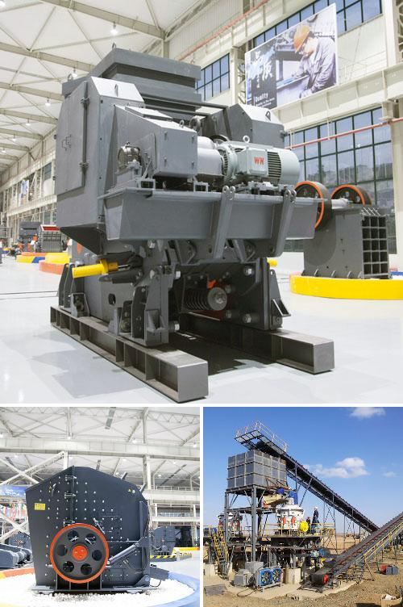

<h3>Why is vertical roller mill-based dry grinding not used in iron ore processing?</h3>
Iron ore is all about rocks, minerals, and compounds. Iron ore is mainly used for manufacturing iron and steel products. It is a crucial raw material for iron and steel production, making it essential to ensure its quality during processing.

Dry processing of iron ore is extensively performed by vertical roller mill-based dry grinding machines. However, there are some factors that restrict the widespread use of these machines in iron ore processing. This article explores the reasons behind it.

One significant reason is the nature of iron ore itself. Iron ore is a hard and abrasive material, making it challenging to mill and grind. Traditional dry grinding processes typically involve breaking down the ore into smaller particles using mechanical equipment, such as crushers and mills. However, the hardness of iron ore often exceeds the capabilities of these machines, leading to increased wear and tear and reduced efficiency.

Vertical roller mill-based dry grinding machines are designed to handle various materials, but they are not specifically optimized for the challenges presented by iron ore. These machines rely on impact, attrition, and compression forces to break down materials. While this works well for many other minerals and compounds, iron ore requires a more specialized approach.

Another reason is the size and shape of iron ore particles. Iron ore typically consists of large lumps and fines with varying sizes and shapes, creating further challenges for dry grinding machines. Vertical roller mills are not always capable of breaking down large lumps effectively, leading to uneven grinding and potentially causing damage to the machine. Furthermore, the shape of iron ore particles can make it difficult for these machines to achieve the desired level of grinding efficiency.

The moisture content of iron ore also plays a crucial role in the efficient grinding of the material. Dry grinding machines, including vertical roller mills, work best when the moisture content of the ore is low. Excessive moisture can cause the ore to become sticky and form clumps, which can impede the grinding process. When processing iron ore, it is often necessary to add water to ensure optimal conditions for grinding. This requirement makes dry grinding machines less suitable for iron ore processing.

In conclusion, vertical roller mill-based dry grinding machines are not widely used in iron ore processing due to various reasons. The inherent hardness, size, and shape of iron ore particles, as well as the moisture content, pose significant challenges for these machines. While they excel in other applications, their limited suitability for iron ore processing necessitates alternative grinding methods to ensure efficient and high-quality iron ore production.
<h3>Contact us</h3><ul><li><strong>Whatsapp:&nbsp;<a href="https://wa.me/8613661969651">+8613661969651</a></strong></li><li><a href="https://swt.shibang-china.com/?git&amp;zhl&amp;Why-is-vertical-roller-mill-based-dry-grinding-not-used-in-iron-ore-processing"><strong>Online Service(chat now)</strong></a></li></ul><h3>Related</h3><ul><li><a href='Why-is-a-vibrating-screen-used-to-send-ore-to-a-rock-crusher.md'>Why is a vibrating screen used to send ore to a rock crusher?</a></li><li><a href='Why-are-carbon-forged-balls-used-in-ball-mills.md'>Why are carbon-forged balls used in ball mills?</a></li><li><a href='Why-is-the-Quarry-Act-important.md'>Why is the Quarry Act important?</a></li><li><a href='Why-is-track-mounted-crushing-plant-at-the-pit-rather-than-fixed-plant.md'>Why is track mounted crushing plant at the pit rather than fixed plant?</a></li><li><a href='Why-choke-fed-cone-crusher.md'>Why choke fed cone crusher?</a></li></ul>