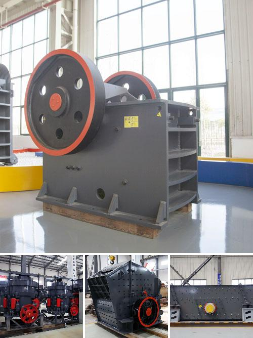

<h3>Why should we use aggregate washing systems?</h3>
Aggregate washing systems have become an integral part of the construction and mining industry. These innovative systems efficiently clean and wash crushed rocks, gravel, and sand to produce high-quality aggregates. The use of aggregate washing systems offers numerous advantages, making it a vital component in various industries.

Firstly, aggregate washing systems help in producing high-quality and consistent aggregates. When natural aggregates are extracted, they often contain impurities such as clay, silt, and other undesirable substances. These impurities can affect the performance and durability of concrete and asphalt, leading to poor construction quality. By using washing systems, these impurities are effectively removed, resulting in clean and consistent aggregates.

Secondly, aggregate washing systems greatly contribute to environmental sustainability. Traditional methods of washing aggregates often involve using large volumes of water. This not only leads to wastage but also causes environmental concerns due to water scarcity in many regions. However, modern aggregate washing systems use advanced technologies that minimize water usage. These systems employ recycling and filtration methods, allowing water to be treated and reused in the washing process. By reducing water consumption, these systems conserve this valuable resource and minimize the environmental footprint of aggregate production.

Furthermore, aggregate washing systems improve the overall efficiency of construction projects. Clean aggregates help optimize the performance of concrete and asphalt, resulting in better workability, increased strength, and improved durability of structures. This translates to cost savings for construction companies, as less material is required to achieve the desired quality. Moreover, using washed aggregates reduces the need for additional chemicals or admixtures, simplifying construction processes and saving time and resources.

Additionally, aggregate washing systems enhance workplace safety. Traditional methods of cleaning aggregates often involve manual labor, exposing workers to potentially harmful dust and materials. The use of washing systems helps eliminate this risk by mechanizing the cleaning process. Workers are no longer required to handle dusty aggregates manually, reducing the chances of respiratory issues and other health hazards. This promotes a safer working environment and reduces the potential for accidents and injuries.

Lastly, aggregate washing systems offer long-term benefits by increasing the lifespan of construction materials and structures. Clean aggregates devoid of impurities ensure the longevity and performance of concrete and asphalt. With washed aggregates, construction projects can withstand harsh weather conditions and heavy traffic for extended periods. This reduces the need for frequent maintenance and repairs, resulting in long-term cost savings for infrastructure development.

In conclusion, the use of aggregate washing systems in various industries is beneficial for multiple reasons. They facilitate the production of high-quality aggregates, contribute to environmental sustainability, improve construction efficiency, enhance workplace safety, and increase the lifespan of construction materials and structures. By incorporating these systems into their operations, construction and mining companies can achieve significant cost savings, ensure the durability of their projects, and contribute to a more sustainable and safer future.
<h3>Contact us</h3><ul><li><strong>Whatsapp:&nbsp;<a href="https://wa.me/8613661969651">+8613661969651</a></strong></li><li><a href="https://swt.shibang-china.com/?git&amp;zhl&amp;Why-should-we-use-aggregate-washing-systems"><strong>Online Service(chat now)</strong></a></li></ul><h3>Related</h3><ul><li><a href='Why-is-it-difficult-to-start-a-ball-mill.md'>Why is it difficult to start a ball mill?</a></li><li><a href='Why-does-a-ball-mill-start-slowly.md'>Why does a ball mill start slowly?</a></li><li><a href='Why-is-the-Quarry-Act-important.md'>Why is the Quarry Act important?</a></li><li><a href='Why-is-a-cyclone-required-in-a-cement-ball-mill.md'>Why is a cyclone required in a cement ball mill?</a></li><li><a href='Why-is-there-less-dust-in-a-vertical-roller-mill.md'>Why is there less dust in a vertical roller mill?</a></li></ul>