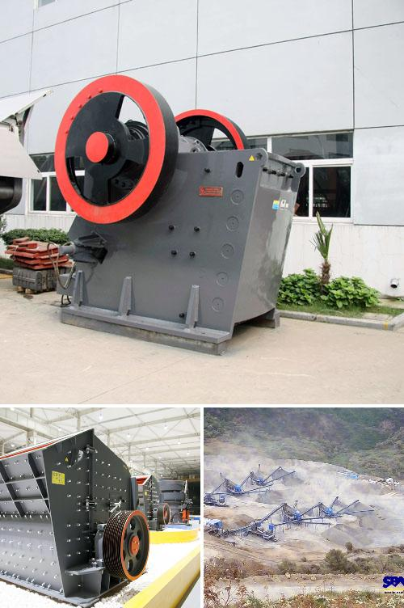

<h3>Why use an impact crusher instead of other crushers?</h3>
When it comes to crushing equipment, there are many options available. However, an impact crusher stands out for several reasons. This type of crusher offers a high reduction ratio, keeps the end product shape consistent, and is known for its efficiency in processing highly abrasive materials. In this article, we will explore why using an impact crusher instead of other crushers is often the best choice.

One of the main advantages of an impact crusher is its ability to produce a wide range of sizes and shapes. Unlike jaw and cone crushers, which are restricted to the size of the raw materials they can accept, impact crushers can create uniform sizes of final products with just a simple adjustment of the impact curtains. This versatility makes them suitable for various applications, such as concrete recycling, asphalt production, and quarrying.

The reduction ratio is another significant advantage of an impact crusher. This ratio refers to the ratio of the size of the incoming feed material to the size of the final product. Impact crushers, by design, produce a higher reduction ratio than other types of crushers like jaw or cone crushers. This means that an impact crusher can reduce even the largest materials into smaller, more manageable sizes, resulting in a higher overall production capacity.

Furthermore, impact crushers excel at producing cubical-shaped end products. Thanks to their unique rotor and impact curtains, these crushers can be highly efficient at shaping the material, ensuring the final product has fewer edges and more consistent shape. This is especially important for applications like concrete and asphalt production, where the shape of the aggregates greatly affects the quality of the finished product.

Another advantage of impact crushers is their efficiency in handling highly abrasive materials. Due to their design, impact crushers are able to withstand the wear caused by frequent impact and high-speed rotor rotation, making them ideal for crushing materials with high silica content or those that are hard and abrasive. This extended durability and lower wear costs make impact crushers a cost-effective solution for industries that deal with abrasive materials.

Additionally, impact crushers are relatively easy to maintain. They often have interchangeable wear parts, such as blow bars or impact plates, which can be replaced individually, reducing downtime and maintenance costs. Regular maintenance and inspection of the impact crusher can help ensure its optimal performance and prolong its lifespan.

In conclusion, an impact crusher offers several advantages that make it a preferred choice in many crushing applications. Its ability to produce a wide range of sizes and shapes, high reduction ratio, consistent product shape, efficient processing of abrasive materials, and ease of maintenance make impact crushers a reliable and cost-effective option. Whether in mining, construction, recycling, or other industries, an impact crusher can provide the necessary crushing power and versatility to meet the demands of various applications.
<h3>Contact us</h3><ul><li><strong>Whatsapp:&nbsp;<a href="https://wa.me/8613661969651">+8613661969651</a></strong></li><li><a href="https://swt.shibang-china.com/?git&amp;zhl&amp;Why-use-an-impact-crusher-instead-of-other-crushers"><strong>Online Service(chat now)</strong></a></li></ul><h3>Related</h3><ul><li><a href='Why-is-the-cone-crusher-known-as-a-gyratory-crusher.md'>Why is the cone crusher known as a gyratory crusher?</a></li><li><a href='Why-is-manganese-jaw-used-in-a-crusher.md'>Why is manganese jaw used in a crusher?</a></li><li><a href='Why-is-there-screening-after-crushing.md'>Why is there screening after crushing?</a></li><li><a href='Why-fine-material-should-not-enter-a-jaw-crusher.md'>Why fine material should not enter a jaw crusher?</a></li><li><a href='Why-is-track-mounted-crushing-plant-at-the-pit-rather-than-fixed-plant.md'>Why is track mounted crushing plant at the pit rather than fixed plant?</a></li></ul>