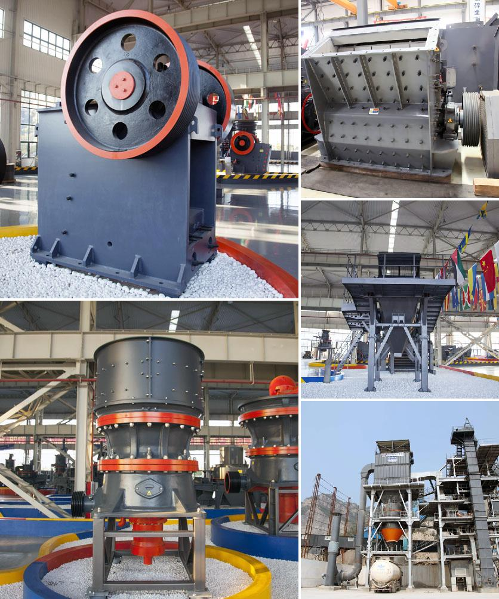

<h3>Why use trunnion bearings in cement mills?</h3>
Trunnion bearings are an essential part of the cement mill system. They provide a stable support for the drum and allow it to rotate smoothly. These bearings are commonly used in the manufacturing industry to ensure high performance and reliable operation of many types of machinery.

Cement mills are designed to grind clinker, gypsum, and other materials into a fine powder. During the grinding process, the mill rotates rapidly, causing the grinding media to collide with the raw material, producing a fine powder. The main components of a cement mill include a rotating drum, grinding media, mill liners, supports, and drives.

One critical component of the cement mill that is exposed to the high temperature and abrasive environment within the drum is the trunnion bearings. These bearings are usually made of bronze or white metal and are lubricated with a thick, viscous oil to protect them from wear and tear.

There are several reasons why trunnion bearings are commonly used in cement mills. First, these bearings provide excellent load-carrying capacity. The rotating drum of a cement mill can weigh anywhere between 15-160 tons, so the bearings that support it have to be able to handle such a heavy load. Trunnion bearings are designed to support this immense weight and ensure smooth, reliable operation.

Secondly, trunnion bearings are self-aligning, which means they have the ability to adapt to misalignment caused by external factors such as uneven foundations or thermal expansion. This is particularly important in cement mills, which are often subjected to high temperatures and significant thermal expansion.

Another advantage of using trunnion bearings in cement mills is their ability to withstand high axial loads. The grinding process in a cement mill generates substantial axial loads, which can cause the grinding media and the drum to deviate from their intended position and, in some cases, damage the mill structure. Trunnion bearings are designed to resist these axial loads and maintain the proper alignment of the drum.

Additionally, trunnion bearings are equipped with a wide range of seals to prevent dust and debris from entering the bearing chamber. In a dusty environment like a cement mill, effective sealing is crucial to prevent premature wear and failure of the bearings.

Lastly, trunnion bearings are relatively easy to maintain. Regular inspections and lubrication of the bearings can significantly extend their lifespan and reduce the risk of unplanned downtime. The use of trunnion bearings eliminates the need for complex hydrodynamic or hydrostatic bearing systems, simplifying maintenance procedures and reducing costs.

In conclusion, trunnion bearings are an integral part of cement mills, playing a vital role in ensuring smooth and reliable operation. Their ability to withstand heavy loads, adapt to misalignment, resist axial loads, and provide effective sealing makes them the preferred choice for cement mill applications. Regular maintenance and proper lubrication are essential to extend the lifespan of these bearings and ensure the optimal performance of cement mills.
<h3>Contact us</h3><ul><li><strong>Whatsapp:&nbsp;<a href="https://wa.me/8613661969651">+8613661969651</a></strong></li><li><a href="https://swt.shibang-china.com/?git&amp;zhl&amp;Why-use-trunnion-bearings-in-cement-mills"><strong>Online Service(chat now)</strong></a></li></ul><h3>Related</h3><ul><li><a href='Why-use-a-double-drive-in-a-ball-mill.md'>Why use a double-drive in a ball mill?</a></li><li><a href='Why-do-you-need-a-mobile-stone-crusher.md'>Why do you need a mobile stone crusher?</a></li><li><a href='Why-is-a-jaw-crusher-used-to-crush-aluminum-ore.md'>Why is a jaw crusher used to crush aluminum ore?</a></li><li><a href='Why-must-cerussitelead-carbonate-be-crushed.md'>Why must cerussite(lead carbonate) be crushed?</a></li><li><a href='Why-is-manganese-ore-crushed.md'>Why is manganese ore crushed?</a></li></ul>